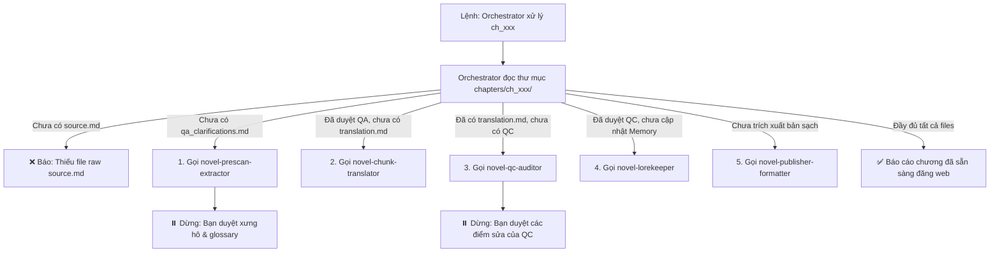

# 🤖 HỆ THỐNG SUBAGENTS & ORCHESTRATOR CHO TIỂU THUYẾT (NOVEL PIPELINE)

Hệ thống được thiết kế theo mô hình **1 Orchestrator điều phối trung tâm** và **5 Subagents chuyên biệt**, tích hợp sẵn trong thư mục [`.agents/skills/`](file:///d:/Nhung/RIDI/trans-assistant/.agents/skills).

---

## 🎯 1. NHẠC TRƯỞNG TRUNG TÂM: `novel-orchestrator`
> Thay vì bạn phải tự nhớ và gọi từng Subagent lẻ tẻ, bạn chỉ cần gọi **Orchestrator**. Nó sẽ tự đọc trạng thái file của chương (`source.md`, `qa_clarifications.md`, `translation.md`, `qc_report.md`, `memory/`) để tự động kích hoạt skill kế tiếp.

* **File định nghĩa:** [`.agents/skills/novel-orchestrator/SKILL.md`](file:///d:/Nhung/RIDI/trans-assistant/.agents/skills/novel-orchestrator/SKILL.md)
* **Câu lệnh gọi siêu ngắn gọn:**
  ```text
  "Orchestrator: tiếp tục xử lý chapter 53 bộ khi-đại-lão-phản-diện..."
  hoặc
  "Orchestrator: chạy pipeline đầy đủ cho ch_053"
  ```

---

## 📋 2. DANH SÁCH 5 SUBAGENTS VỆ TINH

Nếu muốn gọi trực tiếp từng Subagent độc lập, bạn có thể triệu hồi bất kỳ lúc nào:

| Subagent | Thư mục Skill | Nhiệm vụ chính | Câu lệnh mẫu nhanh trong Chat |
| :--- | :--- | :--- | :--- |
| **0. Orchestrator** | [.agents/skills/novel-orchestrator/](file:///d:/Nhung/RIDI/trans-assistant/.agents/skills/novel-orchestrator/SKILL.md) | **Tự động kiểm tra tiến độ chương và gọi skill phù hợp** | `"Orchestrator: xử lý ch_053"` |
| **1. Pre-Scan & Extractor** | [.agents/skills/novel-prescan-extractor/](file:///d:/Nhung/RIDI/trans-assistant/.agents/skills/novel-prescan-extractor/SKILL.md) | Quét raw, tìm thực thể mới, tên tiếng Anh, lập 2 bảng QA | `"Dùng novel-prescan-extractor quét raw của chapter [ch_053] và lập bảng QA."` |
| **2. Chunk Translator** | [.agents/skills/novel-chunk-translator/](file:///d:/Nhung/RIDI/trans-assistant/.agents/skills/novel-chunk-translator/SKILL.md) | Dịch chuẩn 1:1, bảo toàn đoạn, cách dòng `\n\n`, đúng ngôi kể | `"Dùng novel-chunk-translator dịch chapter [ch_053] theo QA đã chốt và AGENTS.md."` |
| **3. QC Auditor** | [.agents/skills/novel-qc-auditor/](file:///d:/Nhung/RIDI/trans-assistant/.agents/skills/novel-qc-auditor/SKILL.md) | Bắt lỗi sót/thừa ý, lệch xưng hô (Character Drift), lỗi timeline | `"Dùng novel-qc-auditor audit bản dịch chapter [ch_053] đối chiếu với source.md và memory."` |
| **4. Lorekeeper** | [.agents/skills/novel-lorekeeper/](file:///d:/Nhung/RIDI/trans-assistant/.agents/skills/novel-lorekeeper/SKILL.md) | Cập nhật tóm tắt timeline, nhân vật và glossary vào `memory/` | `"Dùng novel-lorekeeper cập nhật timeline và nhân vật của chapter [ch_053] vào memory."` |
| **5. Publisher & Formatter** | [.agents/skills/novel-publisher-formatter/](file:///d:/Nhung/RIDI/trans-assistant/.agents/skills/novel-publisher-formatter/SKILL.md) | Lọc bản dịch sạch, chuẩn hóa typography, tạo metadata & mẫu post | `"Dùng novel-publisher-formatter tạo bản dịch sạch và meta.json cho chapter [ch_053]."` |

---

## 🔄 3. BẢNG ĐIỀU PHỐI TỰ ĐỘNG CỦA ORCHESTRATOR



---

## 💡 4. HAI CHẾ ĐỘ VẬN HÀNH CỦA ORCHESTRATOR

1. **Chế độ Tương Tác Có Checkpoints (Khuyên dùng):**
   * Orchestrator chạy tự động nhưng sẽ **chủ động dừng lại ở 2 thời điểm cần con người quyết định**:
     - *Dừng 1:* Sau khi lập 2 Bảng QA để bạn chốt xưng hô và thuật ngữ mới.
     - *Dừng 2:* Sau khi xuất Báo cáo QC để bạn duyệt đề xuất sửa lỗi trước khi ghi đè vào bản dịch chính và bộ nhớ.
2. **Chế độ Tự Động Hoàn Toàn (Fast Auto-Pilot):**
   * Dùng khi bạn tin tưởng hoàn toàn vào các quy định có sẵn trong `AGENTS.md` và `memory/`:
   * Lệnh: `"Orchestrator: tự động chạy trọn gói chapter [ch_xxx] từ raw đến bản dịch sạch"`
