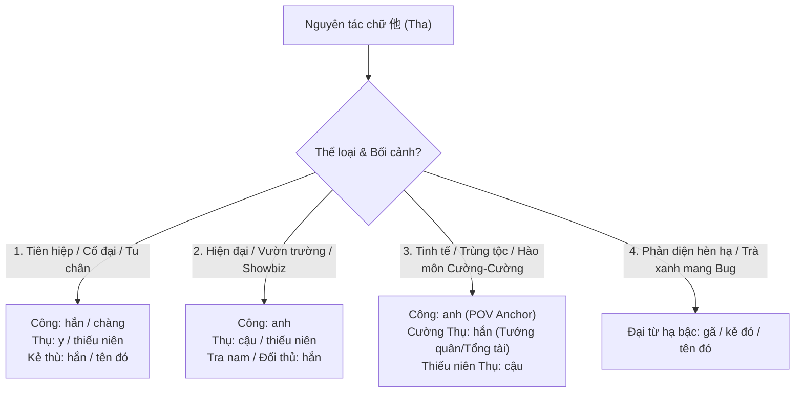

# QUY CHUẨN GỢI Ý ĐẠI TỪ NGÔI THỨ BA (ANH, CẬU, Y, HẮN) THEO THỂ LOẠI & ARC TRUYỆN

> [!IMPORTANT]
> **PHẠM VI ÁP DỤNG (SCOPE SPECIFICATION):**
> - **CHỈ ÁP DỤNG DUY NHẤT** cho các bộ truyện nằm trong thư mục `novel_projects/**` (các tiểu thuyết đam mỹ, khoái xuyên, tu chân, tinh tế...).
> - **TUYỆT ĐỐI KHÔNG ÁP DỤNG** cho các file dịch thuật và QC nằm ngoài thư mục này, bao gồm:
>   - Thư mục `input/qc/**` và `output/qc/**`
>   - Truyện thợ săn / Hunter Hàn Quốc (như SVR - The S-Classes That I Raised, Han Yoojin, v.v.)
>   - Toàn bộ các dự án manhwa / manga / webtoon khác ngoài `novel_projects`.
>   - Đối với các file ngoài `novel_projects`, tuân thủ theo `glossary/` và `characters.md` riêng của từng dự án đó.

---

## 1. NGUYÊN TẮC BẢN CHẤT CỦA CÁC ĐẠI TỪ (PRONOUN SPECTRUM)

Trong tiếng Trung, nguyên tác thường dùng chung đại từ `他` (tha) cho mọi nhân vật nam. Khi chuyển ngữ sang tiếng Việt, việc lựa chọn đại từ ngôi thứ ba trần thuật (`anh`, `cậu`, `y`, `hắn`, `gã`) đóng vai trò quyết định đến **văn phong (tone)**, **đẳng cấp nhân vật**, và **sự rõ ràng của ngôi kể (POV)**.

| Đại từ | Sắc thái bản chất & Khí chất | Bối cảnh / Thể loại tối ưu | Vai trò nhân vật khuyến nghị |
| :---: | :--- | :--- | :--- |
| **`anh`** | Điềm tĩnh, chín chắn, phong độ, trưởng thành, người che chở / bảo bọc / lớn tuổi hơn. | Hiện đại, Đô thị, Giới giải trí, Tinh tế / Cơ giáp, Hào môn thế gia, Xuyên nhanh. | • **Công** (mặc định trong truyện Chủ Công để làm **POV Anchor** khi công lớn tuổi hơn hoặc ngang hàng). • ⭐ **THỤ (khi Thụ LỚN TUỔI HƠN Công trong truyện chủ công niên hạ)**. • Nhân vật nam trưởng thành, có địa vị cao, đáng tin cậy. |
| **`cậu`** | Trẻ trung, thanh tú, thiếu niên, thư sinh, đáng yêu, nhỏ tuổi hơn, người được bảo bọc. | Vườn trường, Đô thị, Showbiz (nghệ sĩ mới), Tinh tế (thiếu niên nghèo khó), Hào môn (thiếu gia thật). | • **Thụ** (mặc định khi thụ nhỏ tuổi hơn hoặc ngang hàng: mỹ cường thảm, trà xanh giả ngoan). • ⭐ **CÔNG (khi Công NHỎ TUỔI HƠN Thụ trong truyện chủ công niên hạ)**. • Nhân vật nam phụ trẻ tuổi, vô hại, thiện lương. |
| **`y`** | Cổ phong tao nhã, thoát tục, cao lãnh, u mặc, mang tính văn học truyền thống hoặc trung tính khách quan. | **Cổ đại, Tiên hiệp, Kiếm hiệp, Tu chân, Quyền mưu, Cung đình hầu tước.** | • **Thụ hoặc Công trong bối cảnh Cổ trang / Tiên hiệp** (như Ma đầu, Kiếm tôn, Thư sinh, Vương gia). • ⚠️ **Hạn chế dùng trong Đô thị / Showbiz hiện đại** (tránh làm văn phong sến súa, lạc quẻ). |
| **`hắn`** | Ngang tàng, sắc bén, cường thế, u ám, nguy hiểm; hoặc biểu thị kẻ thù, tra nam. | • Tinh tế / Trùng tộc (Quân thư cấp SS, Trùm ngầm). • Hào môn (Tổng tài tàn tật, phản diện u ám). • Tiên hiệp / Tu chân. • Mọi thể loại khi chỉ đối thủ / kẻ phản diện. | • **Cường Thụ / Lãnh khốc Thụ** (trong truyện Chủ công để tách bạch với Công = `anh`). • **Công cường đại, bá đạo** (trong tiên hiệp đối xứng với Thụ = `y`). • **Phản diện / Tra công / Tình địch**. |
| **`gã` / `kẻ đó`** | Khinh miệt, hạ thấp nhân phẩm, kẻ đê tiện, tâm cơ xấu xa, hèn hạ. | Mọi thể loại khi miêu tả phản diện đáng ghét, trà xanh mang bug, kẻ tiểu nhân. | • Phản diện hèn hạ (Chu Lạc Lạc, Felo, Elio...). |

---

## 2. MA TRẬN GỢI Ý THEO THỂ LOẠI (GENRE MATRIX)

### 2.1. Bối cảnh Cổ đại / Tiên hiệp / Tu chân / Quyền mưu
* **Công thức chuẩn:** Cặp bài trùng **`hắn` (Công) $\times$ `y` (Thụ)** hoặc **`y` (Thụ thoát tục) $\times$ `hắn` (Đại ma đầu/Vương gia)**.
* **Quy tắc cấm kỵ:** Tuyệt đối **KHÔNG dùng `anh` - `cậu`** trong lời kể trần thuật của truyện Tiên hiệp / Tu chân cổ trang (gây hiện đại hóa lố bịch).
* *Ví dụ thực tế (`đại-ma-đầu-nhật-nhật-tưởng-sát-ngã`):*
  * Hạ Khanh Tuyên (Công - đệ tử tiên môn): **hắn**
  * Ứng Hàn Y (Thụ - ma đầu phong ấn vực sâu): **y** (kết hợp gọi danh xưng *ma đầu, Ma tôn*).

### 2.2. Bối cảnh Hiện đại / Đô thị / Giới giải trí / Vườn trường
* **Công thức chuẩn:** Cặp đôi **`anh` (Công) $\times$ `cậu` (Thụ)**.
* Công là chỗ dựa, người dẫn dắt; Thụ là nghệ sĩ tài năng bị vùi dập, thiếu gia thất lạc, hoặc thiếu niên trà xanh giả ngoan.
* Phản diện, tư bản bẩn, tra nam: Dùng **`hắn`**.
* *Ví dụ thực tế:*
  * `thụ-trà-xanh`: Thẩm Phi Triết = **anh**; Cố Tùy Châu (16-17 tuổi) = **cậu** *(CẤM dùng "hắn" hay "anh" cho Cố Tùy Châu)*.
  * `phan-dien-truyen-nguoc-dinh-cong-khong-lam-nua` (TG2 - Showbiz): Chương Thừa Dư = **anh**; Ký Hoài = **cậu**.

### 2.3. Bối cảnh Tinh tế / Cơ giáp / Trùng tộc / Hào môn Cường - Cường
Tùy thuộc vào thiết lập Thụ là **Cường Thụ (ngang tàng/lạnh lùng)** hay **Nhược/Mỹ Thụ (thiếu niên)**:
* **Nếu Thụ là Cường Thụ / Tướng quân / Trùm ngầm / Lớn tuổi hơn:**
  * Công = **`anh`** (làm điểm neo chủ công)
  * Thụ = **`hắn`** (thể hiện chất nam tính, uy quyền, ngang tàng, tách bạch hoàn toàn với Công).
  * *Ví dụ:*
    * `khi-đại-lão-phản-diện-sắm-vai-nhân-vật-chính-kho` (TG1 - Trùng tộc): Sở Tư Thừa = **anh**; Alex Sachsen (Tướng quân SS) = **hắn**.
    * `khi-đại-lão-phản-diện-sắm-vai-nhân-vật-chính-kho` (TG2 - Hào môn): Sở Tư Thừa = **anh**; Thẩm Từ (Đại lão u ám) = **hắn**.
    * `công-vai-chính-công`: Quý Thần Hi = **anh**; Trì Chước (Trùm thế giới ngầm) = **hắn**.
* **Nếu Thụ là Thiếu niên cơ giáp / Tinh cầu rác:**
  * Công = **`anh`**
  * Thụ = **`cậu`**
  * *Ví dụ:* `phan-dien-truyen-nguoc-dinh-cong-khong-lam-nua` (TG1 - Tinh tế): Thích Sơ = **anh**; Yến Kiêu = **cậu**.

### 2.4. QUY TẮC NIÊN HẠ TRONG TRUYỆN CHỦ CÔNG (THỤ LỚN TUỔI HƠN CÔNG)
> [!IMPORTANT]
> **QUY TẮC VÀNG VAI VẾ TUỔI TÁC:**
> Trong truyện **Chủ công**, nếu **Thụ lớn tuổi hơn Công** (thể loại Niên hạ công $\times$ Niên thượng thụ / Thụ là tiền bối, anh lớn, cấp trên lớn tuổi hơn):
> - **Công (nhỏ tuổi hơn):** Dùng đại từ trần thuật ngôi 3 là **`cậu`** (đối thoại xưng `tôi` hoặc `em`, gọi Thụ là `anh`).
> - **Thụ (lớn tuổi hơn):** Dùng đại từ trần thuật ngôi 3 là **`anh`** (đối thoại xưng `tôi` hoặc `anh`, gọi Công là `cậu` / `nhóc`).
> - ⚠️ **Mục đích:** Tôn trọng tuyệt đối thứ bậc tuổi tác tự nhiên trong tiếng Việt, loại bỏ hoàn toàn cảm giác ngượng ngùng khi nhân vật ít tuổi hơn lại được trần thuật là "anh" trước mặt người lớn tuổi hơn.

---

## 3. GỢI Ý BỔ SUNG CHO TRUYỆN ĐƠN NGUYÊN VĂN (KHOÁI XUYÊN NHIỀU ARC)
*Ví dụ điển hình: "Phản diện truyện ngược đình công không làm nữa", "Tiến hành cứu vớt phản diện buồn tình"*

| Arc / Thế giới | Bối cảnh đặc trưng | Đề xuất Đại từ Công | Đề xuất Đại từ Thụ | Đề xuất Đại từ Phản diện / Tra nam |
| :--- | :--- | :---: | :---: | :---: |
| **Arc Hiện đại / Hào môn cẩu huyết** | Tổng tài tàn tật u ám, biến thái bệnh kiều | **anh** | **hắn** (u ám, lạnh lùng) hoặc **cậu** (khi yếu đuối) | **hắn** / **gã** |
| **Arc Cổ đại / Quyền mưu / Chiến tranh** | Tướng quân bị hủy dung, hoàng tử phế truất | **hắn** | **y** (tướng quân, phong vị cổ trang) | **hắn** / **tên đó** |
| **Arc Tinh tế / Trùng tộc** | Thiếu tướng Trùng cái SS, sa điêu hùng trùng | **anh** | **hắn** (thiếu tướng quân đội) | **hắn** / **gã** (hùng trùng hám danh) |
| **Arc Trinh thám / Huyền nghi** | Tàn tật ngồi xe lăn, hung thủ / nạn nhân ngầm | **anh** | **hắn** hoặc **cậu** | **hắn** / **kẻ đó** |
| **Arc Tu chân / Tiên hiệp** | Ma tu, kiếm tu phản diện, tiên tôn đọa ma | **hắn** | **y** | **hắn** / **ma đầu** |

---

## 4. QUY TẮC VÀNG TRÁNH LỖI (ANTI-CONFUSION GOLDEN RULES)

1. **Quy tắc "Một Dòng Một Vua" (POV Anchor):**
   - Trong cùng một câu hoặc một đoạn văn miêu tả hai người tương tác, **tuyệt đối không dùng cùng 1 đại từ `anh - anh` hoặc `hắn - hắn`** cho cả hai người.
   - Bắt buộc phải có sự phân ngôi rạch ròi: `anh - hắn`, `anh - cậu`, `hắn - y`, hoặc gọi trực tiếp tên/danh xưng để độc giả không phải đoán ai đang làm gì.

2. **Quy tắc Linh hồn Nhập xác (Possession Continuity):**
   - Với truyện xuyên nhanh / mượn xác nhập hồn: Đại từ ngôi 3 tự sự **bắt buộc đi theo linh hồn nhân vật chính** (luôn là `anh` xuyên suốt), không được chốc chốc gọi `anh` (khi nhớ về bản thân), chốc chốc gọi `cậu` (khi gọi theo tên thân xác nguyên chủ).

3. **Phân biệt rạch ròi Ngôi 3 Tự sự vs Lời đối thoại:**
   - Ngôi 3 tự sự dùng `hắn` để tả Thụ (Alex, Thẩm Từ, Thiệu Khâm Hàn) **KHÔNG ĐỒNG NGHĨA** với việc trong đối thoại họ xưng hô thô lỗ.
   - Trong đối thoại, Thụ vẫn xưng hô đúng lễ nghi: xưng `tôi` - gọi `cậu`, hoặc xưng `em` - gọi `anh` khi tình cảm sâu đậm.

4. **Tuyệt đối không mang "tao - mày" vào bối cảnh quý tộc / tinh tế:**
   - Dù là đối đầu sinh tử, hãy dùng `ta - ngươi` hoặc danh xưng sắc lạnh để giữ trọn đẳng cấp của tác phẩm.
