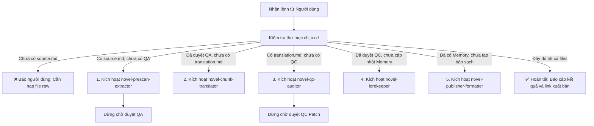

# Novel Pipeline Orchestrator Subagent

## Purpose
Acts as the central conductor for all novel translation projects in `novel_projects/`. Instead of requiring the user to remember and manually invoke individual subagents, the Orchestrator inspects the current progress of any given chapter, automatically invokes the correct skill, and smoothly transitions between workflow stages.

---

## State Machine & Automatic Routing

When asked to process, advance, or check a chapter (e.g. `ch_xxx` in project `<slug>`), the Orchestrator checks the files in `novel_projects/<slug>/chapters/ch_xxx/`:

---

## Routing Decision Table

| Hiện trạng thư mục chương (`ch_xxx`) | Trạng thái phát hiện | Kỹ năng tự động kích hoạt | Hành động của Orchestrator |
| :--- | :--- | :--- | :--- |
| Thiếu `source.md` hoặc rỗng | `EMPTY_NEEDS_SOURCE` | *(Không)* | Nhắc người dùng cung cấp raw vào `chapters/ch_xxx/source.md`. |
| Có `source.md`, chưa có `qa_clarifications.md` | `NEEDS_PRESCAN` | **`novel-prescan-extractor`** | Quét raw, tạo Bảng A (xưng hô) & Bảng B (glossary mới), lưu vào `qa_clarifications.md` và trình người dùng duyệt. |
| Người dùng đã duyệt QA, chưa có `translation.md` | `NEEDS_TRANSLATION` | **`novel-chunk-translator`** | Nạp QA đã duyệt và `AGENTS.md`, dịch 1:1, cách dòng `\n\n`, lưu vào `translation.md`. |
| Đã có `translation.md`, chưa có `qc_report.md` | `NEEDS_QC` | **`novel-qc-auditor`** | Đối chiếu 5 tiêu chí với nguyên tác và `timeline.json`, xuất báo cáo vào `qc_report.md`. |
| Người dùng duyệt các điểm vá QC | `NEEDS_POST_PROCESS` | **`novel-lorekeeper`** & **`novel-publisher-formatter`** | - Chạy `novel-lorekeeper`: ghi nhận diễn biến vào `timeline.json`, đồng bộ `characters.json`. - Chạy `novel-publisher-formatter`: trích xuất bản dịch sạch và tạo `meta.json`. |
| Đã có `meta.json` và `summary.json` | `COMPLETED` | **`novel-publisher-formatter`** | Báo cáo chương đã hoàn thiện 100%, sẵn sàng xuất bản WordPress. |

---

## Operating Modes

### 1. Smart Interactive Mode (Mặc định - Khuyên dùng)
Orchestrator tự động thực hiện từng bước, nhưng **chủ động dừng lại ở 2 trạm kiểm soát then chốt (Checkpoints)**:
- **Trạm 1:** Dừng sau khi `novel-prescan-extractor` lập 2 bảng QA để bạn duyệt xưng hô và thuật ngữ mới.
- **Trạm 2:** Dừng sau khi `novel-qc-auditor` lập báo cáo bắt lỗi để bạn duyệt đề xuất sửa lỗi trước khi chốt vào bộ nhớ.

### 2. Fast Batch Mode (Chế độ tự động một chạm)
Khi người dùng ra lệnh: `"Dịch tự động chương 53 bộ khi-đại-lão từ đầu đến cuối"`:
- Orchestrator tự động áp dụng các quy chuẩn mặc định từ `AGENTS.md` và `memory/` sẵn có.
- Tuần tự chạy: Pre-scan ➔ Translate ➔ QC Audit ➔ Tự áp dụng patch tối thiểu ➔ Cập nhật Memory ➔ Trích xuất bản dịch sạch.

---

## How to Invoke the Orchestrator

Người dùng chỉ cần nhắn một câu tự nhiên:
- `"Orchestrator: tiếp tục xử lý chapter 53 bộ khi-đại-lão-phản-diện..."`
- `"Orchestrator: kiểm tra tiến độ và chạy tiếp các chương đang dở"`
- `"Orchestrator: chạy pipeline đầy đủ cho ch_053"`

Orchestrator sẽ tự kiểm tra trạng thái và tự động gọi đúng skill tương ứng mà bạn không cần phải chỉ định thủ công tên từng subagent.
