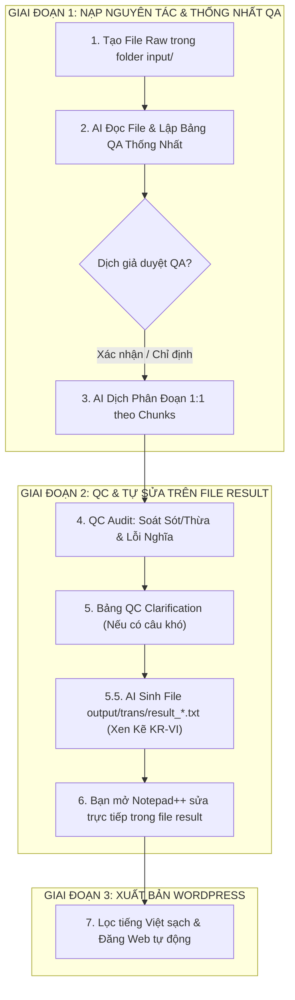
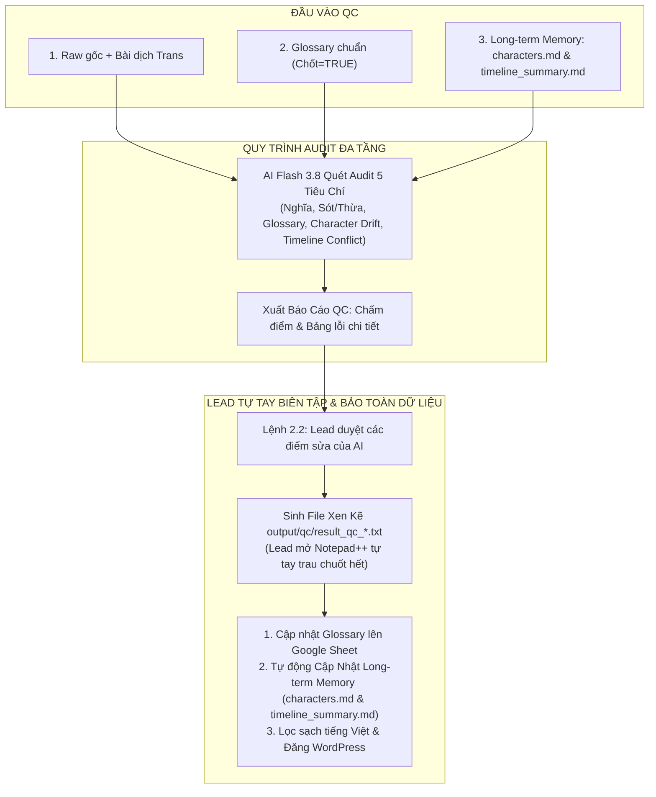

# 📖 QUY TRÌNH CHUẨN DỊCH & KIỂM DUYỆT TIỂU THUYẾT (TRANSLATION & QC SOP)
> **Mục tiêu:** Xây dựng quy trình làm việc khép kín dựa trên file (**File-based Workflow**) từ khâu nạp raw ở thư mục `input/`, sinh file kết quả xen kẽ ở `output/` để bạn tự biên tập thủ công bằng Notepad++, đến khâu tự động xuất bản lên WordPress.  
> **Độ dài tối ưu:** 2.000 – 3.000 từ/chương.

---

## ⛔ NGUYÊN TẮC BẤT DI BẤT DỊCH (CORE NON-NEGOTIABLE RULES)

> ⚠️ **Quy tắc bảo toàn 1:1 (Strict Fidelity):**  
> 1. **ZERO OMISSION (Không bớt):** Tuyệt đối không bỏ sót bất kỳ câu thoại, chi tiết cử chỉ, hành động hay bối cảnh nào dù là nhỏ nhất. Không được dịch lướt hay tóm tắt.  
> 2. **ZERO ADDITION (Không thêm):** Tuyệt đối không tự suy diễn, không phóng tác, không chèn cảm xúc/lời bình của dịch giả, không tự chế thêm tình tiết để làm văn "bay bổng".  
> 3. **PARAGRAPH ALIGNMENT (Bảo toàn số đoạn 1:1):** Mỗi đoạn văn trong bản gốc KR/EN phải tương ứng chính xác với 1 đoạn trong bản dịch tiếng Việt. **Không tự ý gộp hai đoạn thành một** và **không tự ý chẻ nhỏ một đoạn**.

---



---

# PHẦN 1: QUY TRÌNH DỊCH THUẬT (TRANSLATION WORKFLOW)

## BƯỚC 1: TẠO FILE RAW TRONG THƯ MỤC `input/` 📂
* Bạn **không cần dán text thô dài dằng dặc vào ô chat**.
* Thay vào đó, bạn chỉ cần tạo 1 file trong thư mục `input/` (ví dụ: `input/test-dịch.md` hoặc `input/chap_326.txt`) và dán raw tiếng Hàn/Anh vào đó.
* Nhắn nhanh cho AI:  
  *`"Tôi vừa tạo raw ở input/test-dịch.md, hãy bắt đầu Bước 1 & 2."`*

## BƯỚC 2: QUY TRÌNH HỎI - ĐÁP THỐNG NHẤT (QA & CLARIFICATION) ⚠️

AI đọc trực tiếp file từ `input/` và đối chiếu với `glossary/glossary.md` hiện tại, sau đó xuất ra **2 BẢNG QA ĐỘC LẬP**:

### 📋 BẢNG A: Thống nhất Xưng hô & Đối thoại
| STT | Cặp nhân vật (KR/EN) | Ngữ cảnh trong chương | AI đề xuất xưng hô | Lựa chọn của bạn |
| :---: | :--- | :--- | :--- | :---: |
| **1** | **Han Yoojin & Han Yoohyun** | Cảnh giao chiến tiềm thức | `anh - em` (Yoojin là anh) | ⭕ Duyệt / ✏️ Sửa |
| **2** | **Han Yoojin & Hwang Rim** | Gặp lần đầu tại hồ bơi | Yoojin: `Tôi - anh`<br>Hwang Rim: `Ta/Tôi` (nói cộc lốc) | ⭕ Duyệt / ✏️ Sửa |
| **3** | **Han Yoojin & Cho Hwa-woon** | Bị giam giữ / độc thoại nội tâm | Gọi: `thằng Cho Hwa-woon` (새끼) | ⭕ Duyệt / ✏️ Sửa |

### 📋 BẢNG B: Liệt kê Glossary Mới (Tên nhân vật, Địa điểm, Danh từ riêng, Kỹ năng)
> *Các từ ngữ này chưa có trong từ điển `glossary/glossary.md` hoặc xuất hiện lần đầu trong chương:*

| STT | Thuật ngữ gốc (KR/EN) | Loại từ | Ngữ cảnh xuất hiện | AI đề xuất dịch | Xác nhận của bạn |
| :---: | :--- | :---: | :--- | :--- | :--- |
| **1** | **황림 (Hwang Rim)** | Nhân vật | Thợ săn cấp S mới xuất hiện | `Hwang Rim` (hoặc Hán-Việt: `Hoàng Lâm`) | ⭕ Chọn: `Hwang Rim` |
| **2** | **관 낭자 (Guan Lang-ja)** | Nhân vật | Nữ Thợ săn ở sân bay | `Quan Nương Tử` | ⭕ Duyệt |
| **3** | **수룡 (Water Dragon)** | Ma thú / Thú cưng | Rồng nước bơi trong hồ | `Thủy Long` | ⭕ Duyệt |
| **4** | **흑우림 (Black Cow Forest)** | Địa danh / Dungeon | Tên hầm ngục rừng bò đen | `Hắc Ngưu Lâm` | ⭕ Duyệt |
| **5** | **뀩!** | Âm thanh | Tiếng kêu của Thủy Long | `- Kyooc!` (hoặc `- Kyoop!`) | ⭕ Chọn: `- Kyooc!` |

---

### 💾 ĐỒNG BỘ 2 CHIỀU THEO THỨ TỰ CHAP & PHÂN TẦNG TRANS - QC 🔄
> ⚠️ **Thực tế làm việc của team:** Nhiều thành viên trans dịch nhảy cóc các chap khác nhau (Trans luôn đi trước tiến độ của QC). Do đó Glossary từ QC luôn là chuẩn mực đầy đủ nhất (`Chốt = TRUE`).

Hệ thống giải quyết triệt để bài toán này qua **3 CƠ CHẾ ĐỒNG BỘ THEO THỨ TỰ CHAP**:

1. **Phân cấp 2 Trạng thái (Trans Draft vs QC Official):**
   * **Từ luồng Trans (Lệnh 1.2):** Thuật ngữ mới do Trans đề xuất ở các chap đi trước sẽ được ghi lên Google Sheet với **`Chốt = FALSE`** (kèm tag `[Chap X]`). Trans khác có thể tham khảo nhưng từ này chưa bị khóa cứng.
   * **Từ luồng QC Lead (Lệnh 2.2):** Khi QC Lead chính thức duyệt đến chap đó, trạng thái được nâng thành **`Chốt = TRUE`** $\rightarrow$ Chính thức trở thành quy chuẩn bất khả xâm phạm.

2. **Tự động Sắp Xếp (Auto-Sort by Chapter Number):**
   * Bất kể thành viên nộp chap 340 trước hay nộp chap 325 sau, sau mỗi lần thêm thuật ngữ mới, hệ thống tự động **sắp xếp lại toàn bộ Google Sheet theo cột `Chap` tăng dần (1, 2, ... 303, 325, 340)**.
   * Bảng tính của team luôn luôn ngăn nắp 100% theo đúng trình tự thời gian truyện, không bao giờ bị nhảy cóc dòng.

3. **Nguyên tắc "Scoped Chap" khi AI Dịch / QC:**
   * Khi bạn dịch hoặc QC cho **Chap N**: AI chỉ áp dụng và ưu tiên cao nhất các thuật ngữ có **`Chap <= N`** đã được QC chốt.
   * Các thuật ngữ ở các chap tương lai (`Chap > N`) chỉ được dùng để **tham khảo tính nhất quán của tên riêng**, tuyệt đối không áp đặt các chi tiết spoiler hoặc kỹ năng tiến hóa của tương lai vào chap hiện tại.

* **Lệnh đồng bộ về máy bất kỳ lúc nào:**  
  Chạy `python scripts/update_glossary.py --sync` để kéo bản phân tầng Chap mới nhất về `glossary/glossary.md`.

---

## BƯỚC 3: DỊCH PHÂN ĐOẠN THÔNG MINH (SMART CHUNKING 1:1)
AI tiến hành dịch toàn bộ file theo xưng hô và glossary đã cập nhật:
* **Kỹ thuật chia Chunk:** Tự động chia chương dài 2.000 – 3.000 từ thành 3 – 4 chunks có context trượt nối tiếp nhau.
* **Bảo toàn 100% nguyên tác:** Số đoạn văn khớp 1:1, không thêm bớt chi tiết, giữ nguyên gạch đầu dòng `-` và các hậu tố xưng hô (`-ie, -ah, ahjussi`).

---

# PHẦN 2: QUY TRÌNH KIỂM DUYỆT & TỰ BIÊN TẬP (QC & MANUAL EDITING)

## 🧠 CƠ CHẾ LONG-TERM MEMORY DÀNH CHO QC (BỘ NHỚ DÀI HẠN)
> 💡 **Giải quyết triệt để vấn đề "AI mất trí nhớ qua các chương":**  
> Khi bộ tiểu thuyết dài hàng trăm chương, dịch giả và QC rất dễ quên diễn biến cũ, dẫn đến việc đổi xưng hô nhân vật (Character Drift) hoặc dịch mâu thuẫn với tình tiết chương trước. Hệ thống lưu trữ bộ nhớ dài hạn trong thư mục `memory/`:

1. **`memory/characters.md` (Hồ sơ Nhân vật, Xưng hô & Tính cách):**
   * Theo dõi: Tên gốc KR/EN, Tên tiếng Việt, Giới tính, Vai trò, Cặp xưng hô cố định (A gọi B là gì, B gọi A là gì), Phong cách nói chuyện (lịch thiệp, cộc lốc, nũng nịu...).
   * Ngăn chặn tình trạng cùng một nhân vật nhưng chap 300 xưng "anh - em", sang chap 320 lại xưng "tôi - cậu".

2. **`memory/timeline_summary.md` (Dòng thời gian & Bối cảnh trượt):**
   * Lưu tóm tắt 2-3 câu cốt lõi sau mỗi chương đã QC (Địa điểm hiện tại, trạng thái thương tích/sức mạnh, biến cố vừa xảy ra, quan hệ nhân vật có thay đổi gì).
   * Khi QC chương $N$, AI đọc bối cảnh chương $N-1, N-2$ để đảm bảo mạch truyện không bị đứt gãy.

---

## BƯỚC 4 & 5: QC PRE-SCAN & BẢNG LỖI CẦN LÀM RÕ (NẾU CÓ)
* AI tự động đối chiếu chéo giữa file raw trong `input/`, bản dịch của thành viên, từ điển `glossary/glossary.md` VÀ bộ nhớ dài hạn `memory/` để bắt trọn:
  1. Lỗi sót câu, thừa ý (Omission / Addition).
  2. Lỗi sai lệch xưng hô & tính cách so với lịch sử (`memory/characters.md`).
  3. Lỗi mâu thuẫn bối cảnh / dòng thời gian so với các chương trước (`memory/timeline_summary.md`).
* Nếu có câu đa nghĩa phức tạp, AI xuất bảng hỏi nhanh để bạn quyết định.

---

## BƯỚC 5.5: SINH FILE KẾT QUẢ XEN KẼ TRONG `output/trans/` 📝 ⚠️ *BƯỚC CỐT LÕI*
> 💡 **Khuyến nghị dùng Tool trên Web App (Tab 📖 Novel Workflow):**  
> Thay vì để AI in lại cả ngàn dòng xen kẽ (dễ bị rớt dòng thoại ngắn hoặc cắt cụt giữa chừng), bạn chỉ cần dán bài dịch tiếng Việt của AI vào **Bước 3 trên Web App** ➔ Bấm nút **"🚀 Ghép File Xen Kẽ 1:1"**. Hệ thống Python sẽ tự động kiểm tra `len(kr) == len(vi)` và ghép chuẩn xác 100% vào `output/trans/result_*.txt`.

### 📋 Định dạng của file phát sinh `output/trans/result_*.txt`:
Toàn bộ chương được dàn trang xen kẽ 1:1 theo chuẩn:
* Mỗi đoạn gốc bắt đầu bằng `KR: ` (hoặc `EN: `).
* Dòng ngay bên dưới là đoạn dịch tiếng Việt tương ứng.
* Giữa mỗi cặp đoạn có 1 dòng trống để cực kỳ thoáng mắt.

```text
KR: ‘S급 헌터인가.’
‘Thợ săn cấp S sao.’

KR: 이곳에는 S급 이상 헌터가 셋 이상 상주한다고 했었다. 하나는 초화운 새끼고 다른 하나는 공항에서 잠깐 본 관 낭자라면 한 명이 더 있어야 했다. 그 남은 하나가 눈앞의 이 남자지 싶었다.
Nghe nói ở đây có từ ba Thợ săn cấp S trở lên thường trực. Một là thằng Cho Hwa-woon, một người khác là Quan Nương Tử vừa thoáng thấy ở sân bay, vậy thì ắt phải còn một người nữa. Tôi đoán người còn lại chính là gã đàn ông trước mắt này.

KR: - 뀩!
- Kyooc!
```

---

## BƯỚC 6: BẠN MỞ NOTEPAD++ SỬA TRỰC TIẾP TRONG FILE `output/trans/result_*.txt` ✍️
1. Mở file `output/trans/result_...txt` vừa sinh ra bằng **Notepad++** (hoặc trình soạn thảo yêu thích của bạn).
2. Bạn tự do đọc và trau chuốt câu từ:
   * Mắt bạn vừa nhìn câu gốc `KR:` ở dòng trên, tay vừa sửa trực tiếp câu tiếng Việt ở dòng dưới.
   * Chỉnh sửa bất kỳ từ ngữ nào theo phong cách cá nhân của bạn.
3. Khi ưng ý, bấm `Ctrl + S` để lưu file lại.

---

## BƯỚC 7: TRÍCH XUẤT BẢN DỊCH SẠCH & ĐĂNG LÊN WORDPRESS 🌐
Sau khi bạn đã lưu file `output/trans/result_...txt`:

1. **Lọc lấy bản dịch sạch (Bỏ các dòng `KR:` / `EN:`):**
   * **Cách 1 (Nhanh nhất & chuẩn 100%):** Mở tab **📖 Novel Workflow** trên Web App ➔ Tại Bước 5 bấm nút **"✂️ Lọc Tiếng Việt Sạch Tức Thì"** (hoàn toàn bằng code Regex, không qua AI nên không bao giờ làm mất chữ).
   * **Cách 2 (Bằng Notepad++):** Nhấn `Ctrl + H` $\rightarrow$ Find what: `^(KR|EN):.*\r?\n` $\rightarrow$ Replace with: để trống $\rightarrow$ Chọn *Regular expression* $\rightarrow$ Bấm *Replace All*.
2. **Đăng lên web:**
   * Copy văn bản tiếng Việt sạch $\rightarrow$ Dán vào tab **🌐 Đăng WordPress** trên Web App.
   * Kiểm tra Live Preview (gạch đầu dòng `-`, tách đoạn `<p>`, chú thích cuối bài `[1]`, `[2]`).
   * Chọn **Công khai (Publish)** hoặc **Bản nháp (Draft)** $\rightarrow$ Bấm **🚀 Xuất bản lên WordPress**!
3. **Đăng thông báo lên Facebook (Copy 1-Click):**
   * Ngay sau khi đăng bài thành công, Web App sẽ tự động tạo sẵn mẫu bài đăng chuẩn của Howl Team:
     ```text
     S-Classes That I Raised chương 325-327:
     https://lazyhowlteam.com/chuong-325-anh-em-giao-chien-5/
     ________________________________________
     Bản dịch thuộc về Howl Team. Vui lòng không reup dưới mọi hình thức. (¬_¬)
     ```
   * Bấm nút sao chép $\rightarrow$ Dán lên Fanpage / Group trong 3 giây!

---

# 📌 BỘ PROMPT TINH GỌN (DÙNG TRONG ANTIGRAVITY IDE VỚI GEMINI 3.8 FLASH)

Quy trình được phân định rõ rệt theo 2 vai trò:

---

## 🅰️ LUỒNG 1: DỊCH TỪ ĐẦU (DÀNH RIÊNG CHO BẠN TỰ DỊCH)
> **Mục đích:** Hỗ trợ bạn tự dịch một chương mới từ raw gốc tiếng Hàn/Anh, bảo toàn 1:1, tự tay sửa văn phong trong Notepad++ rồi đăng web.

### 🔹 Lệnh 1.1: Quét tiền trạm & Lập 2 Bảng QA
```text
Tôi vừa nạp file raw ở [input/tên_file.md].
Hãy đọc file raw, đối chiếu với [glossary/glossary.md] và xuất:
1. BẢNG A: Cặp nhân vật và đề xuất xưng hô đối thoại trong ngữ cảnh chương.
2. BẢNG B: Các glossary/thuật ngữ mới (tên nhân vật mới, địa danh, kỹ năng, quái vật) kèm phân loại và phương án dịch đề xuất.
(LƯU Ý: Chỉ xuất 2 bảng QA, CHƯA dịch toàn văn cho đến khi tôi duyệt).
```

### 🔹 Lệnh 1.2: Chốt QA $\rightarrow$ Ghi Glossary, Dịch 1:1 & Sinh File Xen Kẽ
```text
Tôi chốt QA như sau: [GHI CHÚ DUYỆT CỦA BẠN].
1. Tự động đẩy các thuật ngữ mới đã duyệt lên Google Sheet 'Thuật ngữ chi tiết' (với cột Chap = '[SỐ CHAP]') và cập nhật [glossary/glossary.md] (bảo vệ tuyệt đối các dòng đã Chốt=TRUE).
2. Dịch toàn văn theo nguyên tắc BẢO TOÀN 1:1 (ZERO ADDITION, ZERO OMISSION) và tạo trực tiếp file kết quả xen kẽ tại [output/trans/result_tên_file.txt] theo định dạng 'KR: ...' / 'EN: ...' kèm bản dịch tiếng Việt bên dưới để tôi tự sửa tay.
```

### 🔹 Lệnh 1.3: Trích xuất bản dịch sạch sau khi sửa tay
```text
Tôi đã chỉnh sửa xong file [output/trans/result_tên_file.txt].
Hãy đọc file này và trích xuất bản dịch tiếng Việt sạch (đã lọc bỏ toàn bộ các dòng KR/EN), sẵn sàng để tôi nạp vào tab Đăng WordPress.
```

---

## 🅱️ LUỒNG 2: QC REVIEW BẢN DỊCH CỦA THÀNH VIÊN TRONG NHÓM (DÀNH CHO QC LEAD)
> **Mục đích:** Bạn đóng vai trò **QC Lead / Biên tập viên trưởng**, dùng **Gemini 3.8 Flash** để thẩm định chất lượng bài nộp của thành viên (trans), bắt lỗi thừa/thiếu, sai nghĩa, lệch glossary đã chốt, đồng thời đối chiếu **Bộ nhớ dài hạn (Long-term Memory)** để ngăn chặn tuyệt đối lỗi nhảy xưng hô và lệch dòng thời gian.



### 🔹 Lệnh 2.1: Chạy QC Audit Đối Chiếu Đa Tầng (Glossary + Long-term Memory)
```text
Tôi là QC Lead đang kiểm duyệt bài nộp của thành viên dịch trong nhóm.
Dưới đây là các tài liệu đối chiếu:
- Bản gốc (KR/EN): [input/raw.md] (hoặc input/qc/kor.txt)
- Bản dịch của thành viên: [input/dich_vi.txt] (hoặc input/qc/vi_to_qc.txt)
- Từ điển thuật ngữ chuẩn: [glossary/glossary.md]
- Hồ sơ nhân vật & xưng hô lịch sử: [memory/characters.md]
- Bối cảnh & tóm tắt các chap trước: [memory/timeline_summary.md]

Hãy đối chiếu chi tiết từng câu của bản dịch với bản gốc và các tài liệu trên để lập BÁO CÁO QC:

1. ĐÁNH GIÁ TỔNG QUAN:
   - Điểm đánh giá chất lượng dịch (thang điểm 10).
   - Nhận xét ưu điểm & các lỗi thường gặp của thành viên (vd: hay dịch sót câu ngắn, văn phong bị cứng, chưa nắm xưng hô...).

2. BẢNG PHÁT HIỆN LỖI CHI TIẾT THEO TỪNG ĐOẠN:
   - Lỗi Nghiêm Trọng: Dịch sai nghĩa gốc, dịch thiếu câu/ý (Omission), tự ý phóng tác/thêm thắt (Addition).
   - Lỗi Lệch Nhân Vật & Xưng Hô (Character Drift): Nhảy xưng hô lệch so với hồ sơ trong [memory/characters.md] hoặc đổi đại từ ngôi 3 không nhất quán.
   - Lỗi Mâu Thuẫn Diễn Biến (Timeline / State Conflict): Dịch sai ngữ cảnh, trái ngược với trạng thái nhân vật / thương tích / địa điểm được tóm tắt trong [memory/timeline_summary.md].
   - Lỗi Quy Ước: Sai lệch thuật ngữ so với các dòng đã Chốt=TRUE trong Google Sheet / Glossary.
   - Gợi ý Diễn Đạt: Câu văn thô, lạm dụng cấu trúc bị động (bị/được/bởi).
   * Format bảng: [Đoạn số] | [Câu gốc KR/EN] | [Câu trans dịch] | [Vấn đề phát hiện] | [Đề xuất sửa tối thiểu (Minimal Patch)]

3. DANH SÁCH THUẬT NGỮ & NHÂN VẬT MỚI:
   - Thuật ngữ mới đề xuất thêm vào Glossary.
   - Nhân vật mới hoặc bước tiến quan hệ mới cần ghi nhận vào Memory.

(CHỈ XUẤT BÁO CÁO VÀ BẢNG LỖI, CHƯA XUẤT TOÀN VĂN).
```

### 🔹 Lệnh 2.2: Lead Duyệt Sửa $\rightarrow$ Cập nhật Memory, Glossary & Sinh File Xen Kẽ để Lead tự sửa
> 💡 **Lead tự sửa toàn diện:** Thay vì trả bài qua lại tốn thời gian, AI sẽ áp các chỉnh sửa được duyệt vào bản dịch của trans và xuất ra file xen kẽ `result_qc_*.txt` để Lead mở Notepad++ vừa nhìn câu gốc vừa tự tay trau chuốt lại toàn bộ.

```text
Tôi duyệt các đề xuất sửa sau: [GHI CHÚ DUYỆT: Vd "Duyệt toàn bộ đề xuất của AI, đoạn 14 giữ nguyên của trans, đoạn 20 sửa theo ý tôi: ..."].

1. CẬP NHẬT GLOSSARY:
   - Tự động đẩy thuật ngữ mới được duyệt lên Google Sheet và cập nhật [glossary/glossary.md].

2. CẬP NHẬT BỘ NHỚ DÀI HẠN (LONG-TERM MEMORY):
   - Nếu có nhân vật mới hoặc mối quan hệ xưng hô mới được xác nhận: Bổ sung dòng mới vào bảng [memory/characters.md].
   - Tóm tắt 2-3 câu ngắn gọn về diễn biến cốt lõi chương này (ai làm gì, đang ở đâu, trạng thái ra sao) và nối tiếp vào cuối file [memory/timeline_summary.md] (ghi rõ [Chap X]).

3. SINH FILE KẾT QUẢ XEN KẼ ĐỂ LEAD TỰ SỬA TOÀN VĂN:
   - Áp dụng các sửa đổi đã duyệt vào bản dịch của trans và tạo file xen kẽ tại [output/qc/result_qc_tên_file.txt] (gồm câu gốc KR: ... và câu dịch tiếng Việt đã patch) để tôi mở Notepad++ vừa đối chiếu raw vừa tự tay chuốt văn lần cuối.
```

### 🔹 Lệnh 2.3: Trích xuất bản dịch sạch sau QC để đăng web
```text
Tôi đã rà soát xong file [output/qc/result_qc_tên_file.txt].
Hãy trích xuất bản dịch tiếng Việt sạch (đã loại bỏ các dòng KR/EN), ghi rõ:
- Tên chương: [Nhập tên chương nếu có]
- Trans: [Tên thành viên dịch] | Beta: [Tên bạn]
Sẵn sàng cho tôi copy nạp vào tab 🌐 Đăng WordPress để xuất bản lên lazyhowlteam.com!
```