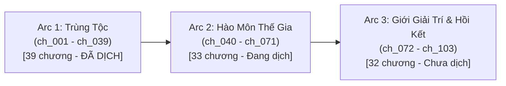

# 📖 DỰ ÁN DỊCH THUẬT: KHI ĐẠI LÃO PHẢN DIỆN SẮM VAI NHÂN VẬT CHÍNH [KHOÁI XUYÊN]
> **Tên gốc:** 当反派大佬扮演主角后(快穿) / 當反派大佬扮演主角後(快穿)  
> **Tác giả:** 眠柒 (Miên Thất)  
> **Thể loại:** Đam mỹ, Xuyên nhanh (Khoái xuyên), Sảng văn, Cường cường, Chủ công  
> **Nguồn Raw chuẩn:** [CZBooks - 当反派大佬扮演主角后](https://czbooks.net/n/sko3609gnm4)  
> **Quy mô dự án:** 85 chương nguyên tác $\rightarrow$ **103 chapters / trang raw** (`ch_001` $\rightarrow$ `ch_103`)  
> **Quy chuẩn chung:** [`AGENTS.md`](AGENTS.md)  
> **Kế hoạch & Quy chuẩn từng Arc:**  
> - **Arc 2:** [`rules_arc_2.md`](rules_arc_2.md) • [`plan_arc_2.md`](plan_arc_2.md)  
> - **Arc 3:** [`rules_arc_3.md`](rules_arc_3.md) • [`plan_arc_3.md`](plan_arc_3.md)  

---

## 📊 1. BẢNG TỔNG QUAN TIẾN ĐỘ DỰ ÁN

| Chỉ số | Số lượng / Trạng thái | Tỷ lệ | Ghi chú |
| :--- | :---: | :---: | :--- |
| **Tổng số chương (Files)** | **103 chapters** | 100% | `ch_001` $\rightarrow$ `ch_103` |
| **Đã dịch (`translation.md`)** | **63 chapters** | **61.2%** | `ch_001` $\rightarrow$ `ch_063` |
| **Đã kiểm toán QC (`qc_report.md`)** | **11 chapters** | **10.7%** | Đang tiếp tục QC theo batch |
| **Chưa dịch** | **40 chapters** | **38.8%** | `ch_064` $\rightarrow$ `ch_103` |
| **Tổng số Thế giới (Arc)** | **3 Arcs + Hồi kết** | - | Trùng tộc $\rightarrow$ Hào môn $\rightarrow$ Giới giải trí & Cục Thời Không |

---

## 🗺️ 2. PHÂN CHIA CÁC ARC (THẾ GIỚI) CHI TIẾT

---

### 🪐 ARC 1: THẾ GIỚI TRÙNG TỘC (虫族世界)
* **Phạm vi chương:** `ch_001` $\rightarrow$ `ch_039` *(Chương raw: Chương 1 $\rightarrow$ Chương 29)*  
  *(Lưu ý: Đoạn cuối `ch_039` là phân cảnh Sở Tư Thừa kết thúc TG1 và chuyển sinh vào khách sạn ở TG2)*.
* **Tổng số chương:** **39 chương**
* **Trạng thái:** ✅ **Đã hoàn thành dịch thuật (39/39 chapters)**
* **Bối cảnh:** Đế quốc Trùng tộc tinh tế, xã hội tôn sùng hùng trùng nhưng biến chất, đấu đá quân đội và hiệp hội bảo vệ.
* **Thiết lập nhân vật:**
  - **Công:** **Sở Tư Thừa** (楚司承) nhập vào thân xác **Ryan** (瑞安) — Hùng trùng cấp S giả phế, nguyên chủ bạch liên hoa yếu đuối bị hãm hại giam ngục tử hình.
  - **Thụ:** **Alex Sachsen** (艾利克斯·萨克森) — Quân thư cấp SS, Tướng quân người hành hình cao ngạo, chán ghét hùng trùng nhưng dần bị chinh phục bởi tinh thần lực và phong thái đại lão của Sở Tư Thừa.
  - **Kẻ mang Bug:** **Felo** (费洛) — Hùng trùng cấp A hám danh, kẻ xuyên không biết trước kịch bản hãm hại Ryan.
  - **Thực thể hắc ám:** **Khô Lâu / Hư ảnh đầu lâu** (骷髅头虚影) — Cấu kết cùng Felo, dùng năng lượng nghịch chuyển thời không.
  - **Nhân vật khác:** **Friedrich** (弗德里希 - Tướng quân quan phối cũ của Ryan), **Heideman** (海德曼 - Hội trưởng Hiệp hội Hùng trùng), **Elio** (艾利欧 - Hôn phu cũ của Alex).
* **Quy chuẩn xưng hô & Đại từ Arc 1:**
  - **Ngôi 3 trần thuật:** Sở Tư Thừa DUY NHẤT dùng **"anh"**; Alex Sachsen dùng **"hắn"**; Friedrich/Elio/Felo dùng **"hắn / gã"**.
  - **Đối thoại Công - Thụ:**
    - Giai đoạn đầu: Sở Tư Thừa gọi *"Sĩ quan / ngài / anh"*; Alex gọi *"ngươi / cậu"*.
    - Thường ngày: Sở Tư Thừa xưng *"tôi"*, gọi *"anh / Alex / Tướng quân"*; Alex xưng *"tôi"*, gọi *"cậu"*. *(Tuyệt đối Alex KHÔNG gọi Sở Tư Thừa là "anh")*.
    - Giai đoạn quy phục / Áp chế tinh thần lực: Alex gọi *"Trùng chủ / Chủ nhân / ngài"*, xưng *"tôi / em"*.
  - **Quy tắc tên riêng:** Tuyệt đối giữ nguyên tên tiếng Anh phương Tây: `Alex Sachsen`, `Ryan`, `Friedrich`, `Felo`, `Heideman`, `Elio`. Cấm phiên âm Hán Việt.
  - **Danh xưng Trùng tộc:** Dùng `"thư trùng"`, `"hùng trùng"`, `"quân thư"`, `"á thư"` (TUYỆT ĐỐI KHÔNG thêm chữ `"con"` phía trước).

---

### 🏙️ ARC 2: THẾ GIỚI HÀO MÔN THẾ GIA (豪门世界)
* **Phạm vi chương:** `ch_040` $\rightarrow$ `ch_071` *(Chương raw: Chương 30 $\rightarrow$ Chương 56)*  
  *(Giao thoa: Khởi đầu từ cuối `ch_039`, kết thúc viên mãn ở nửa đầu `ch_072`)*.
* **Tổng số chương:** **33 chương** (`ch_039[part 2]` + `ch_040` $\rightarrow$ `ch_071` + `ch_072[part 1]`)
* **Trạng thái:** 🔄 **Đang xử lý (Đã dịch 24/33 chapters: `ch_040` $\rightarrow$ `ch_063`)**
  - **Đang chờ dịch tiếp:** `ch_064` $\rightarrow$ `ch_071` (8 chương).
* **Bối cảnh:** Hào môn đô thị hiện đại, giới kinh doanh, tiệc rượu thượng lưu, đấu đá gia tộc Thẩm thị và Lệ thị.
* **Thiết lập nhân vật:**
  - **Công:** **Sở Tư Thừa** nhập vào thân xác **Tống Lạc An** (宋乐安) — Sinh viên đại học kiêm "chim hoàng yến" từng tận tụy chăm sóc tra công tàn phế suốt 3 năm.
  - **Thụ:** **Thẩm Từ** (沈辞) — Tổng tài / Đại lão phản diện Thẩm thị, đối thủ cạnh tranh của Lệ Yến Trạch, bề ngoài lạnh lùng thâm sâu nhưng ôn nhu che chở cho Sở Tư Thừa.
  - **Kẻ mang Bug:** **Chu Lạc Lạc** (周洛洛) — Kẻ trọng sinh mang Bug "thuật đọc tâm", giả vờ trà xanh ngây thơ tranh đoạt hào quang.
  - **Tra công nguyên tác:** **Lệ Yến Trạch** (厉晏泽) — Tổng tài tàn tật được Tống Lạc An chữa lành nhưng bạc bẽo, tự phụ, ghen tuông bệnh hoạn.
  - **Nhân vật phụ:** Bố Tống (Tống Thiên - gã bợm rượu tham tiền), Quản gia Trương, nhóm nghiên cứu Viện khoa học quốc gia.
* **Quy chuẩn xưng hô & Đại từ Arc 2 (CẬP NHẬT MỚI):**
  - **Ngôi 3 trần thuật:**
    - **Công (Sở Tư Thừa / Tống Lạc An):** Dùng đại từ **"cậu"** (thay cho "anh" ở Arc 1).
    - **Thụ (Thẩm Từ):** Dùng đại từ **"anh"** (thay cho "hắn" ở Arc 1).
    - **Phản diện / Tra nam (Lệ Yến Trạch):** Dùng **"hắn"** (tuyệt đối KHÔNG dùng "anh").
    - **Trà xanh (Chu Lạc Lạc):** Dùng **"gã"**.
  - **Xưng hô đối thoại Công - Thụ:**
    - **Thụ (Thẩm Từ):** Xưng **"anh"** (hoặc *"tôi"* trong công việc), gọi Sở Tư Thừa là **"cậu"**.
    - **Công (Sở Tư Thừa):** Xưng **"cậu"** (khi đối thoại bình đẳng) hoặc *"tôi / em"*, gọi Thẩm Từ là **"anh"** / *"Thẩm Từ"* / *"Ông chủ"*.
  - **Đối thoại với Tra công & Trà xanh:** Sở Tư Thừa dùng thái độ mỉa mai, dứt khoát vạch trần bộ mặt giả dối, xưng *"tôi - anh"* hoặc xưng hô trung tính đanh thép.

---

### 🎬 ARC 3: THẾ GIỚI GIỚI GIẢI TRÍ & HỒI KẾT (娱乐圈世界 & 终卷)
* **Phạm vi chương:** `ch_072` (nửa sau) $\rightarrow$ `ch_103` *(Chương raw: Chương 57 $\rightarrow$ Chương 85 + Hồi kết thực tại)*.
* **Tổng số chương:** **32 chương** (`ch_072[part 2]` $\rightarrow$ `ch_103`)
* **Trạng thái:** ⏳ **Chưa dịch (0/32 chapters: `ch_072` $\rightarrow$ `ch_103`)**
* **Bối cảnh:** 
  1. Giới giải trí hiện đại: Đoàn làm phim, chương trình tống nghệ, diễn đàn mạng, đạn mạc kịch bản, mối quan hệ gia đình tái hôn.
  2. Hồi kết thực tại: Cục Quản Lý Thời Không (時空管理局) — Trụ sở Bộ phận Phản diện.
* **Thiết lập nhân vật:**
  - **Công:** **Sở Tư Thừa** nhập vào thân xác **Khương Niệm An** (姜念安) — Diễn viên tuyến 18, từng trải qua giai đoạn sụp đổ bị bạn trai cũ chia tay và đóng băng sự nghiệp (phong sát), bị kẻ xuyên không bôi nhọ qua đạn mạc.
  - **Thụ (Thế giới 3):** **Lộ Vũ Minh** (路宇鸣) — Nam sinh cấp 3 (lớp 12), con riêng của mẹ kế (dì Lộ), em trai kế trên danh nghĩa gửi sang ở nhờ nhà Sở Tư Thừa; tính cách ngoài lạnh trong nóng, quật cường, mang linh hồn của Thụ qua các kiếp.
  - **Thụ (Chính thể ngoài đời thực - Hồi kết `ch_103`):** **Khương Lê** (姜黎) — Nhân viên tổ Phản diện Cục Quản Lý Thời Không, người luôn bị Trưởng ban mắng vì đóng vai phản diện mà thế giới nào cũng yêu say đắm vai chính.
  - **Tra công / Bug:** **Tần Uyên** (秦渊) — Kim chủ / bạn trai cũ nguyên tác của Khương Niệm An, kẻ phong sát và quay lưng lại với nguyên chủ; các đối thủ cạnh tranh trong giới showbiz.
  - **Nhân vật phụ:** Ba Khương, Mẹ Lộ, Trưởng ban Phản diện Cục Quản Lý Thời Không.
* **Quy chuẩn xưng hô & Đại từ Arc 3 (CẬP NHẬT MỚI):**
  - **Ngôi 3 trần thuật:**
    - **Công (Sở Tư Thừa / Khương Niệm An):** Dùng đại từ **"cậu"** (đồng bộ cùng Arc 2).
    - **Thụ (Lộ Vũ Minh / Khương Lê):** Dùng đại từ **"anh"**.
    - **Tra nam / Phản diện (Tần Uyên):** Dùng **"hắn"** (tuyệt đối KHÔNG dùng "anh").
  - **Xưng hô đối thoại Công - Thụ:**
    - **Thụ (Lộ Vũ Minh):** Xưng **"anh"**, gọi Sở Tư Thừa là **"cậu"**.
    - **Công (Sở Tư Thừa):** Xưng **"cậu"** (hoặc *"tôi / em"*), gọi Lộ Vũ Minh là **"anh"**.
  - **Phân cảnh Hồi kết (Tại Cục Thời Không - cuối `ch_103`):**
    - **Khương Lê (Thụ):** Xưng *"anh"* (hoặc *"tôi"*), gọi Sở Tư Thừa là *"cậu"*.
    - **Sở Tư Thừa (Công):** Xưng *"cậu"* (hoặc *"tôi / em"*), gọi Khương Lê là *"anh"*.

---

## 📌 3. BẢNG TIẾN ĐỘ CHI TIẾT THEO TỪNG CHƯƠNG

| Khoảng chương | Arc | Nội dung chính | Trạng thái Translation | Trạng thái QC |
| :---: | :---: | :--- | :---: | :---: |
| `ch_001` - `ch_015` | **Arc 1** | Phòng hành hình, bộc lộ cấp S, khống chế Alex, Hiệp hội Hùng trùng | ✅ 15/15 | ✅ 11/15 (ch_001 $\rightarrow$ ch_011) |
| `ch_016` - `ch_030` | **Arc 1** | Alex động tình, vạch trần Felo, kỳ cuồng bạo, chiến dịch quân sự | ✅ 15/15 | ⏳ Đang chờ QC |
| `ch_031` - `ch_039` | **Arc 1** | Xử lý Felo và Khô Lâu, đám cưới thế kỷ Alex, chuyển sinh sang TG2 | ✅ 9/9 | ⏳ Đang chờ QC |
| `ch_040` - `ch_050` | **Arc 2** | Khách sạn đụng độ Thẩm Từ, tiệc rượu, vạch mặt trà xanh Chu Lạc Lạc | ✅ 11/11 | ⏳ Đang chờ QC |
| `ch_051` - `ch_063` | **Arc 2** | Thuật đọc tâm bị lộ, phế tay tra nam, đảo ngược thời không, dọn về Thẩm gia | ✅ 13/13 | ⏳ Đang chờ QC |
| `ch_064` - `ch_071` | **Arc 2** | Phản đòn triệt để Lệ gia, thu hồi toàn bộ hào quang, kết thúc viên mãn TG2 | ⏳ 0/8 | ⏳ Chưa dịch |
| `ch_072` - `ch_085` | **Arc 3** | Chuyển sinh Khương Niệm An, thu nhận Lộ Vũ Minh, trở lại giới giải trí | ⏳ 0/14 | ⏳ Chưa dịch |
| `ch_086` - `ch_102` | **Arc 3** | Đập tan đạn mạc bôi nhọ, vạch mặt Tần Uyên, tình cảm thăng hoa cùng Lộ Vũ Minh | ⏳ 0/17 | ⏳ Chưa dịch |
| `ch_103` | **Arc 3 & End** | Đại kết cục TG3, trở về Cục Quản Lý Thời Không, nhận kèm cặp Khương Lê | ⏳ 0/1 | ⏳ Chưa dịch |

---

## ⚙️ 4. NGUYÊN TẮC THI HÀNH KỸ THUẬT (PIPELINE STANDARD)

1. **Paragraph Alignment 1:1 Tuyệt Đối:**
   - Mỗi đoạn văn bản dịch trong `translation.md` phải khớp chính xác 1:1 với đoạn tương ứng trong `source.md`.
   - Không được tự ý gộp đoạn, tách đoạn, bỏ sót câu thoại hay chèn thêm lời bình.
2. **Khoảng cách dòng chuẩn (`\n\n`):**
   - Giữa mọi đoạn văn trần thuật và lời thoại bắt buộc phải có **đúng 1 dòng trống (`\n\n`)**.
   - Tuyệt đối cấm các đoạn văn dính liền nhau (`\n`) không có dòng trống.
3. **Quy tắc Đại từ theo Arc (QUAN TRỌNG):**
   - **Arc 1 (Trùng tộc):** Công (Sở Tư Thừa) = **"anh"**; Thụ (Alex Sachsen) = **"hắn"**.
   - **Arc 2 (Hào môn) & Arc 3 (Giới giải trí & Hồi kết):**
     - **Công (Sở Tư Thừa / Tống Lạc An / Khương Niệm An):** Dùng đại từ **"cậu"**.
     - **Thụ (Thẩm Từ / Lộ Vũ Minh / Khương Lê):** Dùng đại từ **"anh"**.
     - **Nhân vật phản diện / tra nam khác (Lệ Yến Trạch, Tần Uyên, Chu Lạc Lạc):** Dùng **"hắn / gã"** (Tuyệt đối CẤM dùng "anh").
4. **Đồng bộ Memory:**
   - Sau khi hoàn thành dịch và QC mỗi Batch, cập nhật các thực thể mới vào:
     - `memory/characters.json`
     - `memory/glossary.json`
     - `memory/relationships.json`
     - `memory/timeline.json`
