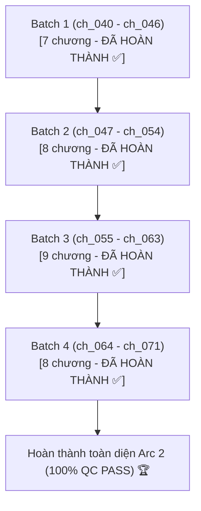

# 📋 KẾ HOẠCH & TIẾN ĐỘ DỊCH THUẬT & QC LẠI ARC 2: HÀO MÔN THẾ GIA

> **Bộ truyện:** Khi Đại Lão Phản Diện Sắm Vai Nhân Vật Chính [Khoái Xuyên]  
> **Thế giới 2:** Hào môn thế gia (Đại lão tâm cơ ngụy chim hoàng yến công Sở Tư Thừa/Tống Lạc An $\times$ Lạnh lùng bá đạo thâm tình tổng tài thụ Thẩm Từ)  
> **Phạm vi chương:** Chương 40 đến Chương 71 (`ch_040` $\rightarrow$ `ch_071`) *(tương ứng Chương raw CZBooks: Chương 30 $\rightarrow$ 56)*  
> **Quy chuẩn áp dụng:** [`rules_arc_2.md`](rules_arc_2.md) & [`AGENTS.md`](AGENTS.md)  
> **Chế độ thực thi:** **Batch Refactor & Translation Mode** (Chuẩn hóa đại từ Công = "cậu", Thụ = "anh", Dịch mới 1:1, Auto QC Audit, Auto Lorekeeper)  
> **Mục tiêu cốt lõi:** **Chuẩn hóa lại 24 chương cũ (`ch_040` $\rightarrow$ `ch_063`) & Dịch mới 8 chương (`ch_064` $\rightarrow$ `ch_071`) $\rightarrow$ Đạt 100% QC_PASSED**

---

## 📊 1. BẢNG TỔNG QUAN TIẾN ĐỘ ARC 2

| Chỉ số | Giá trị | Ghi chú |
| :--- | :---: | :--- |
| **Tổng số chương Arc 2** | **32 chapters** | `ch_040` $\rightarrow$ `ch_071` *(giao thoa cuối ch_039 và đầu ch_072)* |
| **Đã dịch (cần refactor & QC lại)** | **0 chapters** | Toàn bộ 24 chương cũ (`ch_040` $\rightarrow$ `ch_063`) đã hoàn tất chuẩn hóa 100% |
| **Chưa dịch (cần dịch mới)** | **0 chapters** | Toàn bộ 8 chương (`ch_064` $\rightarrow$ `ch_071`) đã dịch mới và QC Approved 100% |
| **Đã QC Approved (theo chuẩn mới)** | **32 / 32** | Đã hoàn thành 100% toàn bộ Arc 2 (Batch 1, 2, 3, 4) đạt chuẩn QC PASSED 100% |
| **Quy chuẩn đại từ mới** | **100% BẮT BUỘC** | **Công (Sở Tư Thừa / Tống Lạc An) = "cậu"** **Thụ (Thẩm Từ) = "anh"** **Tra công (Lệ Yến Trạch) = "hắn"** **Đối thoại: Thụ xưng "anh" - gọi "cậu"; Công gọi "anh" - xưng "cậu / tôi / em"** |

---

## 📦 2. PHÂN CHIA CÁC BATCH CHI TIẾT

---

### 🔹 BATCH 1: Đêm Khách Sạn & Vạch Trần Trà Xanh (7 chương: `ch_040` $\rightarrow$ `ch_046`) — [ĐÃ HOÀN THÀNH & QC APPROVED 100% ✅]
* **Nhiệm vụ:**
  - Chạy script rà soát và chuyển đổi đại từ ngôi 3: Sở Tư Thừa/Tống Lạc An $\rightarrow$ **"cậu"**, Thẩm Từ $\rightarrow$ **"anh"**.
  - Kiểm tra đối thoại: Thẩm Từ xưng *"anh"*, gọi *"cậu"*; Sở Tư Thừa gọi *"anh"*.
  - Chạy `novel-qc-auditor` xuất báo cáo `qc_report.md` đạt chuẩn 100% PASS cho toàn bộ 7 chương.

| Chapter ID | Tên chương | Số đoạn 1:1 | Trạng thái hiện tại | Nhiệm vụ thực thi | Tóm tắt sự kiện chính |
| :---: | :--- | :---: | :---: | :---: | :--- |
| [`ch_040`](chapters/ch_040) | Chương 40: Khách sạn định mệnh | 84 | ✅ Đã QC Pass 100% | Đổi pronoun: Công="cậu", Thụ="anh", Tra="hắn" | Sở Tư Thừa vừa nhập xác Tống Lạc An bị chuốc thuốc; Khống chế bản năng không làm bậy với Thẩm Từ; Lệ Yến Trạch gõ cửa |
| [`ch_041`](chapters/ch_041) | Chương 41: Vở kịch bắt gian | 91 | ✅ Đã QC Pass 100% | Đổi pronoun: Công="cậu", Thụ="anh", Tra="hắn", Phản="gã" | Lệ Yến Trạch đưa Chu Lạc Lạc tới phòng bắt gian nhưng vồ hụt; Sở Tư Thừa ung dung đối đáp |
| [`ch_042`](chapters/ch_042) | Chương 42: Đập vỡ bình hoa | 103 | ✅ Đã QC Pass 100% | Đổi pronoun: Công="cậu", Thụ="anh", xóa lỗi "Ngài Sachsen" ➔ "Thẩm tổng", sửa "Lệ Án Trạch" | Lệ Yến Trạch ép Sở Tư Thừa nhận tội; Cậu cầm bình hoa đập thẳng đầu gối tra nam vừa bình phục |
| [`ch_043`](chapters/ch_043) | Chương 43: Thuật đọc tâm giả vờ | 96 | ✅ Đã QC Pass 100% | Đổi pronoun: Công="cậu", Thụ="anh", đồng bộ Tống Lạc Minh, Tống Lạc Mỹ | Chu Lạc Lạc dùng thuật đọc tâm thao túng; Sở Tư Thừa cười lạnh nhìn thấu kịch bản |
| [`ch_044`](chapters/ch_044) | Chương 44: Thẩm Từ thức tỉnh | 94 | ✅ Đã QC Pass 100% | Đổi pronoun: Công="cậu", Thụ="anh", Tra="hắn" | Thẩm Từ tỉnh lại trong phòng tắm khách sạn, bắt đầu ấn tượng sâu sắc với chàng thiếu niên Tống Lạc An |
| [`ch_045`](chapters/ch_045) | Chương 45: Đối chất tại Cảnh Viên | 104 | ✅ Đã QC Pass 100% | Đổi pronoun: Công="cậu", Thụ="anh", Tra="hắn", chuẩn hóa chim hoàng yến | Lệ Yến Trạch ôm chân đau gầm rú; Sở Tư Thừa ung dung thu dọn đồ đạc, không nhượng bộ nửa bước |
| [`ch_046`](chapters/ch_046) | Chương 46: Cuộc gọi cảm ơn | 102 | ✅ Đã QC Pass 100% | Đổi pronoun: Công="cậu", Thụ="anh", Tra="hắn", Hệ thống chuẩn | Sở Tư Thừa gọi điện cho Thẩm Từ cảm ơn chuyện ở khách sạn; Không khí mờ ám bắt đầu nhen nhóm |

---

### 🔹 BATCH 2: Thẩm Từ Tiếp Cận & Nộp Trà Xanh Cho Quốc Gia (8 chương: `ch_047` $\rightarrow$ `ch_054`) — [ĐÃ HOÀN THÀNH & QC APPROVED 100% ✅]
* **Nhiệm vụ:**
  - Chuyển đổi toàn diện hệ thống đại từ sang Công: "cậu", Thụ: "anh", Tra công: "hắn", Phản diện Chu Lạc Lạc: "gã".
  - Kiểm tra xưng hô đối thoại giữa Thẩm Từ và Sở Tư Thừa: Thẩm Từ gọi *"cậu"*, xưng *"anh"*.
  - Sửa lỗi terminology: Chuẩn hóa "Thẩm thị", "Thẩm tổng", "cậu Tống", ngoặc thoại cong `“...”`.
  - Chạy `novel-qc-auditor` xuất báo cáo `qc_report.md` đạt chuẩn 100% PASS cho toàn bộ 8 chương.

| Chapter ID | Tên chương | Số đoạn 1:1 | Trạng thái hiện tại | Nhiệm vụ thực thi | Tóm tắt sự kiện chính |
| :---: | :--- | :---: | :---: | :---: | :--- |
| [`ch_047`](chapters/ch_047) | Chương 47: Lời mời phỏng vấn | 109 | ✅ Đã QC Pass 100% | Đổi pronoun: Công="cậu", Thụ="anh", Tra="hắn" | Thẩm Từ tạo cơ hội mời Sở Tư Thừa ứng tuyển thực tập sinh tại tập đoàn Thẩm thị |
| [`ch_048`](chapters/ch_048) | Chương 48: Cuộc gặp tại Thẩm thị | 103 | ✅ Đã QC Pass 100% | Đổi pronoun: Công="cậu", Thụ="anh", Phản="gã" | Sở Tư Thừa đến Thẩm thị; Thẩm Từ phong thái tổng tài lạnh lùng nhưng ánh mắt luôn dõi theo cậu |
| [`ch_049`](chapters/ch_049) | Chương 49: Bữa trưa riêng tư | 104 | ✅ Đã QC Pass 100% | Đổi pronoun: Công="cậu", Thụ="anh" | Thẩm Từ giữ Sở Tư Thừa ăn trưa trong phòng làm việc riêng; Sự rung động của hai linh hồn định mệnh |
| [`ch_050`](chapters/ch_050) | Chương 50: Tiệc rượu thượng lưu | 95 | ✅ Đã QC Pass 100% | Đổi pronoun: Công="cậu", Thụ="anh", Tra="hắn", Phản="gã" | Đụng độ Lệ Yến Trạch và Chu Lạc Lạc tại dạ tiệc; Chu Lạc Lạc cố tình dùng tiếng lòng đọc tâm để bôi nhọ |
| [`ch_051`](chapters/ch_051) | Chương 51: Tiếng lòng lộ diện | 104 | ✅ Đã QC Pass 100% | Đổi pronoun: Công="cậu", Thụ="anh", sửa "Shen" ➔ "Thẩm", "ông Tống" ➔ "cậu Tống" | Hiện tượng dị thường: Tiếng lòng của Chu Lạc Lạc bỗng nhiên phát thanh cho toàn bộ quan khách nghe thấy |
| [`ch_052`](chapters/ch_052) | Chương 52: Bộ mặt thật của trà xanh | 83 | ✅ Đã QC Pass 100% | Đổi pronoun: Công="cậu", Thụ="anh", Tra="hắn", Phản="gã", sửa "ông Tống" | Toàn bộ âm mưu đen tối của Chu Lạc Lạc bị phơi bày trước ánh sáng; Sở Tư Thừa tạt nước nóng tái hiện hiện trường |
| [`ch_053`](chapters/ch_053) | Chương 53: Nộp cho Viện nghiên cứu | 82 | ✅ Đã QC Pass 100% | Đổi pronoun: Công="cậu", Thụ="anh", Tra="hắn", Phản="gã" | Thẩm Từ nhanh chóng báo cáo hiện tượng dị năng lên Viện nghiên cứu quốc gia để tống Chu Lạc Lạc đi thí nghiệm |
| [`ch_054`](chapters/ch_054) | Chương 54: Lệ Yến Trạch tìm bố Tống | 82 | ✅ Đã QC Pass 100% | Đổi pronoun: Công="cậu", Thụ="anh", Tra="hắn", Phản="gã", bố Tống | Lệ Yến Trạch tự não bổ rằng Sở Tư Thừa yêu mình sâu đậm; Tìm bố Tống nghiện rượu lên bắt cóc tình thân |

---

### 🔹 BATCH 3: Phế Tay Tra Nam, Đảo Ngược Thời Không & Về Bên Thẩm Từ (9 chương: `ch_055` $\rightarrow$ `ch_063`) — [ĐÃ HOÀN THÀNH & QC APPROVED 100% ✅]
* **Nhiệm vụ:**
  - Chuẩn hóa toàn bộ đại từ: Công = "cậu", Thụ = "anh", Tra công = "hắn", Chu Lạc Lạc = "gã", trợ lý = "cậu".
  - Kiểm tra cảnh tái thiết lập thời gian (`ch_057` $\rightarrow$ `ch_058`), đảm bảo tính logic và xưng hô nhất quán.
  - Chạy `novel-qc-auditor` xuất báo cáo `qc_report.md` đạt chuẩn 100% PASS cho toàn bộ 9 chương.

| Chapter ID | Tên chương | Số đoạn 1:1 | Trạng thái hiện tại | Nhiệm vụ thực thi | Tóm tắt sự kiện chính |
| :---: | :--- | :---: | :---: | :---: | :--- |
| [`ch_055`](chapters/ch_055) | Chương 55: Dùng cây lau nhà chặn đường | 110 | ✅ Đã QC Pass 100% | Đổi pronoun: Công="cậu", Thụ="anh", Tra="hắn", trợ lý="cậu" | Sở Tư Thừa cầm cây lau nhà đập tan mưu mô bắt cóc đạo đức của bố Tống và Lệ Yến Trạch |
| [`ch_056`](chapters/ch_056) | Chương 56: Giẫm nát tay tra nam | 89 | ✅ Đã QC Pass 100% | Đổi pronoun: Công="cậu", Thụ="anh", Tra="hắn" | Sở Tư Thừa phế tay bố Tống, đá Lệ Yến Trạch vào thùng rác và giẫm nát tay hoàn thành KPI ngược tra |
| [`ch_057`](chapters/ch_057) | Chương 57: Khô Lâu nghịch chuyển thời không | 104 | ✅ Đã QC Pass 100% | Đổi pronoun: Công="cậu", Thụ="anh", Tra="hắn", Phản="gã" | Hư ảnh đầu lâu câu kết Felo dùng năng lượng quay ngược thời gian đưa Chu Lạc Lạc về sảnh tiệc; Sở Tư Thừa giữ nguyên ký ức |
| [`ch_058`](chapters/ch_058) | Chương 58: Đón trên xe Thẩm Từ | 91 | ✅ Đã QC Pass 100% | Đổi pronoun: Công="cậu", Thụ="anh", Tra="hắn", trợ lý="cậu" | Thời không đảo ngược; Lệ Yến Trạch đòi ép về nhà bị đòi 1000 tệ lương; Thẩm Từ lái xe đón Sở Tư Thừa về Cảnh Viên |
| [`ch_059`](chapters/ch_059) | Chương 59: Lời mời về bên anh | 99 | ✅ Đã QC Pass 100% | Đổi pronoun: Công="cậu", Thụ="anh", trợ lý="cậu" | Sở Tư Thừa tuyên bố muốn từ chức tình nhân; Thẩm Từ bốc đồng ngỏ lời mời cậu về bên cạnh mình |
| [`ch_060`](chapters/ch_060) | Chương 60: Chấp nhận lời mời | 103 | ✅ Đã QC Pass 100% | Đổi pronoun: Công="cậu", Thụ="anh", Tra="hắn" | Sở Tư Thừa gọi Thẩm Từ là "ông chủ"; Về Cảnh Viên thu dọn đồ; Thẩm Từ đích thân gõ cửa Cảnh Viên |
| [`ch_061`](chapters/ch_061) | Chương 61: Anh xứng sao? | 109 | ✅ Đã QC Pass 100% | Đổi pronoun: Công="cậu", Thụ="anh", Tra="hắn", Phản="gã" | Chu Lạc Lạc lộ tiếng lòng ghen tị; Lệ Yến Trạch chất vấn; Sở Tư Thừa vặc lại "Anh xứng sao?" khiến tra nam bẽ bàng |
| [`ch_062`](chapters/ch_062) | Chương 62: Tôi chủ động tiếp cận cậu ấy | 111 | ✅ Đã QC Pass 100% | Đổi pronoun: Công="cậu", Thụ="anh", Tra="hắn", Phản="gã" | Thẩm Từ nắm tay Sở Tư Thừa tuyên bố chính mình theo đuổi cậu; Vạch mặt lời dối trá của Chu Lạc Lạc |
| [`ch_063`](chapters/ch_063) | Chương 63: Mập mờ trong xe | 102 | ✅ Đã QC Pass 100% | Đổi pronoun: Công="cậu", Thụ="anh", Tra="hắn" | Sở Tư Thừa tuyên bố chưa từng lên giường với Lệ Yến Trạch; Trên xe cùng Thẩm Từ, không khí cuồng nhiệt mập mờ |

---

### 🔹 BATCH 4: Phản Đòn Triệt Để, Xử Lý Khô Lâu & Đại Kết Cục Arc 2 (8 chương: `ch_064` $\rightarrow$ `ch_071`) — [ĐÃ HOÀN THÀNH & QC APPROVED 100% ✅]
* **Nhiệm vụ:**
  - Dịch mới 100% bằng skill `novel-chunk-translator` áp dụng ngay quy chuẩn chuẩn: Công = "cậu", Thụ = "anh".
  - Kiểm tra 1:1 Paragraph Alignment, không sót đoạn văn.
  - Chạy `novel-qc-auditor` và cập nhật sự kiện vào `timeline.json`.

| Chapter ID | Tên chương | Số đoạn 1:1 | Trạng thái hiện tại | Kế hoạch thực thi | Tóm tắt sự kiện chính |
| :---: | :--- | :---: | :---: | :---: | :--- |
| [`ch_064`](chapters/ch_064) | Chương 64: Về biệt thự riêng | 120 | ✅ Đã QC Pass 100% | Dịch mới & QC 1:1 | Thẩm Từ đưa Sở Tư Thừa về biệt thự Thẩm gia; Trợ lý báo Lệ Yến Trạch hẹn gặp Sở Tư Thừa ở bệnh viện |
| [`ch_065`](chapters/ch_065) | Chương 65: Gặp lại ở bệnh viện | 104 | ✅ Đã QC Pass 100% | Dịch mới & QC 1:1 | Lệ Yến Trạch giả vờ thâm tình muốn nối lại tình xưa, Chu Lạc Lạc đóng kịch bạch liên hoa; Sở Tư Thừa nhìn thấu |
| [`ch_066`](chapters/ch_066) | Chương 66: Bóc trần kẻ trọng sinh | 108 | ✅ Đã QC Pass 100% | Dịch mới & QC 1:1 | Sở Tư Thừa bóc trần sự thật Chu Lạc Lạc là kẻ trọng sinh ăn chơi bỏ rơi tra nam kiếp trước; Thẩm Từ bước ra chống lưng |
| [`ch_067`](chapters/ch_067) | Chương 67: Tôi chỉ có một chim hoàng yến | 102 | ✅ Đã QC Pass 100% | Dịch mới & QC 1:1 | Lệ Yến Trạch xin lỗi; Thẩm Từ bảo vệ Sở Tư Thừa; Sở Tư Thừa thi triển kỹ năng đóng băng thời gian |
| [`ch_068`](chapters/ch_068) | Chương 68: Đầu lâu đàm phán | 93 | ✅ Đã QC Pass 100% | Dịch mới & QC 1:1 | Chu Lạc Lạc hoảng sợ; Đầu lâu xuất hiện nhắc tới Ryan và Cục Quản lý Thời Không hòng dùng Thẩm Từ uy hiếp |
| [`ch_069`](chapters/ch_069) | Chương 69: Tiêu diệt Bug Khô Lâu | 106 | ✅ Đã QC Pass 100% | Dịch mới & QC 1:1 | Sở Tư Thừa tiêu diệt Bug Khô Lâu; Chu Lạc Lạc mất ký ức trọng sinh và đối mặt Chu gia phá sản; Về công ty chơi game |
| [`ch_070`](chapters/ch_070) | Chương 70: Kỹ năng trói định linh hồn | 104 | ✅ Đã QC Pass 100% | Dịch mới & QC 1:1 | Ngược tâm Lệ Yến Trạch đạt 150%; Sở Tư Thừa quay ra kỹ năng trói định linh hồn; Thẩm Từ nghiêm túc tỏ tình |
| [`ch_071`](chapters/ch_071) | Chương 71: Nắng ấm ban mai (Đại kết cục Arc 2) | 115 | ✅ Đã QC Pass 100% | Dịch mới & QC 1:1 | Sở Tư Thừa và Thẩm Từ trói định linh hồn; Thẩm Từ gọi 'Trùng...'; Sở Tư Thừa thực tập tại Thẩm thị, hạnh phúc viên mãn |

---

## 🛠️ 3. QUY TRÌNH THỰC THI CHUẨN XÓA LỖI & QC BATCH ARC 2
1. **Bước 1 (Batch 1, 2, 3):** Chạy script Python quét và refactor toàn bộ đại từ của 24 chương cũ (`ch_040` $\rightarrow$ `ch_063`):
   - Đổi trần thuật Sở Tư Thừa / Tống Lạc An: `"anh"` $\rightarrow$ `"cậu"`.
   - Đổi trần thuật Thẩm Từ: `"hắn"` $\rightarrow$ `"anh"`.
   - Đảm bảo Lệ Yến Trạch / Chu Lạc Lạc giữ nguyên `"hắn / gã"`.
   - Chuẩn hóa lời thoại đối thoại: Thẩm Từ xưng `"anh"`, gọi `"cậu"`; Sở Tư Thừa gọi `"anh"`, xưng `"cậu / tôi / em"`.
2. **Bước 2 (Batch 1, 2, 3):** Chạy `novel-qc-auditor` tự động rà soát và ghi đè `qc_report.md` đạt chuẩn 100% PASS.
3. **Bước 3 (Batch 4):** Dịch mới lần lượt 8 chương (`ch_064` $\rightarrow$ `ch_071`) bằng `novel-chunk-translator`, chạy QC ngay sau mỗi chương.
4. **Bước 4 (Lorekeeper):** Cập nhật `memory/timeline.json` hoàn tất toàn bộ tiến trình của Arc 2.
