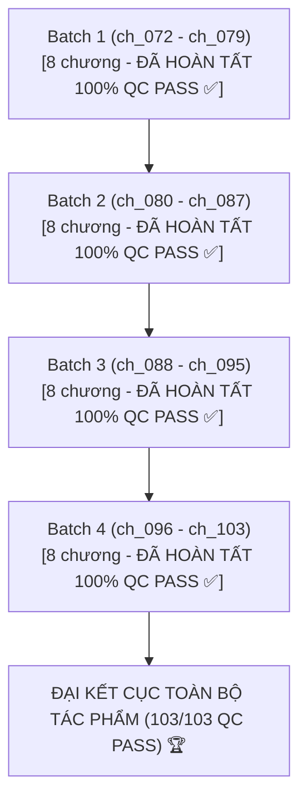

# 📋 KẾ HOẠCH & TIẾN ĐỘ DỊCH THUẬT & QC ARC 3: GIỚI GIẢI TRÍ & HỒI KẾT

> **Bộ truyện:** Khi Đại Lão Phản Diện Sắm Vai Nhân Vật Chính [Khoái Xuyên]  
> **Thế giới 3:** Giới giải trí & Hồi kết Cục Quản Lý Thời Không (Diễn viên tuyến 18 công Sở Tư Thừa/Khương Niệm An $\times$ Niên hạ học sinh cấp 3 thụ Lộ Vũ Minh / Khương Lê)  
> **Phạm vi chương:** Chương 72 đến Chương 103 (`ch_072` $\rightarrow$ `ch_103`) *(tương ứng Chương raw CZBooks: Chương 57 $\rightarrow$ 85 + Hồi kết)*  
> **Quy chuẩn áp dụng:** [`rules_arc_3.md`](rules_arc_3.md) & [`AGENTS.md`](AGENTS.md)  
> **Chế độ thực thi:** **Fast Batch Mode** (Dịch 1:1, Auto QC Audit, Auto Lorekeeper theo từng đợt)  
> **Mục tiêu cốt lõi:** **Dịch mới & Kiểm toán QC 32 chương (`ch_072` $\rightarrow$ `ch_103`) $\rightarrow$ Khóa chặt quy chuẩn Công = "cậu", Thụ = "anh" $\rightarrow$ Đạt 100% QC PASS TOÀN BỘ TÁC PHẨM**

---

## 📊 1. BẢNG TỔNG QUAN TIẾN ĐỘ ARC 3 & TOÀN BỘ DỰ ÁN

| Chỉ số | Giá trị | Ghi chú |
| :--- | :---: | :--- |
| **Tổng số chương Arc 3** | **32 / 32 chapters** | `ch_072` $\rightarrow$ `ch_103` *(Đã dịch & QC PASS 100%)* |
| **Tổng số chương toàn tác phẩm** | **103 / 103 chapters** | `ch_001` $\rightarrow$ `ch_103` *(Đã dịch & QC PASS 100%)* |
| **Đã hoàn thành (QC_PASSED)** | **32 / 32 (Arc 3) | 103 / 103 (Toàn bộ)** | Toàn bộ 4 Batch Arc 3 đã hoàn tất xuất sắc |
| **Đang chờ xử lý** | **0 chapters** | Hoàn thành trọn vẹn toàn bộ dự án |
| **Tiến độ tổng thể** | **100%** | **HOÀN THÀNH TOÀN BỘ TÁC PHẨM (103/103 QC PASS)** |
| **Quy chuẩn đại từ bắt buộc** | **100% PASS** | **Công (Khương Niệm An / Sở Tư Thừa) = "cậu"** **Thụ (Lộ Vũ Minh / Khương Lê) = "anh"** **Tra công (Tần Uyên) = "hắn"** **Đối thoại: Thụ xưng "anh" - gọi "cậu"; Công gọi "anh" - xưng "cậu / tôi / em"** |

---

## 📦 2. PHÂN CHIA CÁC BATCH CHI TIẾT

---

### 🔹 BATCH 1: Mở Đầu Showbiz & Đón Thiếu Niên Về Nhà (8 chương: `ch_072` $\rightarrow$ `ch_079`) — [ĐÃ HOÀN TẤT 100% QC PASS ✅]
* **Mục tiêu:**
  - Nửa đầu `ch_072`: Kết thúc ngọt ngào Arc 2 cùng Thẩm Từ, ước hẹn kiếp sau.
  - Nửa sau `ch_072`: Sở Tư Thừa chuyển sinh vào diễn viên Khương Niệm An; Bố gọi điện gửi con riêng của mẹ kế là Lộ Vũ Minh sang ở nhờ; Sở Tư Thừa lập tức nhận ra thiếu niên mang linh hồn của người thương.
  - Khóa chặt quy chuẩn: Công = **"cậu"**, Thụ = **"anh"**.

| Chapter ID | Tên chương | Số đoạn raw | Trạng thái QC | Tiến độ | Tóm tắt sự kiện chính |
| :---: | :--- | :---: | :---: | :---: | :--- |
| [`ch_072`](chapters/ch_072) | Chương 72: Mở đầu giới giải trí & Duyên phận thiếu niên | 123 | ✅ QC PASS | 100% | Tạm biệt Thẩm Từ kiếp trước; Nhập xác Khương Niệm An; Lộ Vũ Minh mặt dán băng cá nhân đứng trước cửa; Bố gọi nhờ trông hộ con trai riêng của vợ mới |
| [`ch_073`](chapters/ch_073) | Chương 73: Tôi ngủ ở đâu? | 112 | ✅ QC PASS | 100% | Lộ Vũ Minh tính cách quật cường, ôm cặp sách hỏi chỗ ngủ; Sở Tư Thừa dọn sô pha rồi dẫn vào phòng ngủ phụ; Tin nhắn gạ tình xuất hiện khiến thiếu niên tức giận |
| [`ch_074`](chapters/ch_074) | Chương 74: Nấu ăn & Bữa cơm gia đình | 125 | ✅ QC PASS | 100% | Lộ Vũ Minh bức xúc đòi báo cảnh sát thay Sở Tư Thừa; Sở Tư Thừa đút gà rán dỗ dành; Nửa đêm Lộ Vũ Minh ngượng ngùng gọi "Anh trai"; Sở Tư Thừa nộp sửa đổi kịch bản |
| [`ch_075`](chapters/ch_075) | Chương 75: Đừng có hỏi bài tôi | 97 | ✅ QC PASS | 100% | Lộ Vũ Minh trằn trọc đoán quá khứ tình cảm của Khương Niệm An; Xác định Bug là Thẩm Nam Nhất (có đạn mạc kịch bản); Sở Tư Thừa hất xô nước đá vào đầu Thẩm Nam Nhất trên giường Tần Uyên |
| [`ch_076`](chapters/ch_076) | Chương 76: Tin đồn phong sát của kim chủ cũ | 114 | ✅ QC PASS | 100% | Sở Tư Thừa gọi kim chủ của Thẩm Nam Nhất tới bắt gian (+10% hào quang); Về nhà đêm muộn bị Lộ Vũ Minh ghen tuông chất vấn; Sáng hôm sau quản gia của Tần Uyên tìm tới tận cửa |
| [`ch_077`](chapters/ch_077) | Chương 77: Thiếu niên che chở | 112 | ✅ QC PASS | 100% | Lộ Vũ Minh xin lỗi vì hiểu lầm, rung động khi được chạm môi; Tần Uyên mắc chứng khao khát tiếp xúc da thịt đề nghị bao nuôi; Sở Tư Thừa dứt khoát cự tuyệt; Vệ sĩ Lý Trình toan cản cửa |
| [`ch_078`](chapters/ch_078) | Chương 78: Kẻ thức tỉnh mang Bug đạn mạc | 96 | ✅ QC PASS | 100% | Lý Trình tấn công dưới hầm xe bị Sở Tư Thừa quật ngã, giẫm lên ngực; Tần gia đẩy hot search bôi nhọ ép cúi đầu; Công ty Thiên Ngu gửi tin kịch bản sửa đổi của Sở Tư Thừa được chọn với thù lao tự định đoạt |
| [`ch_079`](chapters/ch_079) | Chương 79: Lấy lại kịch bản đổi đời | 95 | ✅ QC PASS | 100% | Quản gia khuyên dựa vào Tần Uyên chống lại Trần Trung; Sở Tư Thừa tuyên bố bỏ nghề diễn viên làm phá sản mưu tính của Tần gia; Về nhà gặp Lộ Vũ Minh ngồi xổm canh cửa chờ vì lo lắng |

---

### 🔹 BATCH 2: Sửa Kịch Bản Bạc Triệu & Mật Thất Địa Ngục Định Tình (8 chương: `ch_080` $\rightarrow$ `ch_087`) — [ĐÃ HOÀN TẤT 100% QC PASS ✅]
* **Mục tiêu:**
  - Sở Tư Thừa bán bản sửa đổi kịch bản tiên hiệp 《Cửu Trọng Thiên》 nhận 50.000 tệ thù lao, dần thoát khỏi cái bóng diễn viên tuyến 18 bị chèn ép.
  - Lộ Vũ Minh đưa Sở Tư Thừa đi chơi phòng trốn thoát 《Thập Bát Tầng Địa Ngục》; dùng máy phát hiện nói dối để thăm dò tình cảm và chính thức thức tỉnh, thừa nhận tình yêu đơn phương dành cho Sở Tư Thừa.
  - Tuân thủ tuyệt đối: 1:1 Paragraph Alignment, khoảng cách `\n\n`, Công = "cậu", Thụ = "anh".

| Chapter ID | Tên chương | Số đoạn raw | Trạng thái QC | Tiến độ | Tóm tắt sự kiện chính (Thực tế) |
| :---: | :--- | :---: | :---: | :---: | :--- |
| [`ch_080`](chapters/ch_080) | Chương 80: Nấu cháo & Ánh mắt chăm chú | 95 | ✅ QC PASS | 100% | Sở Tư Thừa thức đêm sửa kịch bản; Lộ Vũ Minh nấu cháo bồi bổ bị bỏng lưỡi được cậu dỗ dành; tương tác ấm áp ngượng ngùng |
| [`ch_081`](chapters/ch_081) | Chương 81: Bán kịch bản & Hẹn hò mật thất | 85 | ✅ QC PASS | 100% | Bán kịch bản tiên hiệp 《Cửu Trọng Thiên》 nhận 50.000 tệ; Lộ Vũ Minh rủ đi chơi Escape Room 《Thập Bát Tầng Địa Ngục》 |
| [`ch_082`](chapters/ch_082) | Chương 82: Quỷ Môn Quan & Hoàng Tuyền Lộ | 86 | ✅ QC PASS | 100% | Vượt ải Quỷ Môn Quan & Hoàng Tuyền Lộ; Sở Tư Thừa bình tĩnh chỉ điểm cơ quan mật thất khiến quỷ sai bối rối |
| [`ch_083`](chapters/ch_083) | Chương 83: Phán quan & Vọng Hương Đài | 78 | ✅ QC PASS | 100% | Vượt ải Vọng Hương Đài; Sở Tư Thừa bẻ gãy câu đố phán quan; Lộ Vũ Minh chuẩn bị kế hoạch riêng cho ải tầng 3 |
| [`ch_084`](chapters/ch_084) | Chương 84: Tầng 3 Bạt Thiệt Địa Ngục | 81 | ✅ QC PASS | 100% | Tầng 3 Bạt Thiệt Địa Ngục: Thử thách máy phát hiện nói dối; một người làm con tin trong phòng tối, một người trả lời |
| [`ch_085`](chapters/ch_085) | Chương 85: Tranh làm con tin phòng tối | 80 | ✅ QC PASS | 100% | Lộ Vũ Minh xung phong vào phòng tối chịu phạt để ép Sở Tư Thừa trả lời 3 câu hỏi thật lòng về tình cảm |
| [`ch_086`](chapters/ch_086) | Chương 86: Thử thách máy phát hiện nói dối | 86 | ✅ QC PASS | 100% | Khởi động máy phát hiện nói dối; Lộ Vũ Minh nín thở chờ đợi câu hỏi đầu tiên về chuyện tình cảm vang lên |
| [`ch_087`](chapters/ch_087) | Chương 87: Thú nhận rung động | 92 | ✅ QC PASS | 100% | Sở Tư Thừa trả lời thật lòng (không yêu người lớn tuổi hơn, chỉ cần là anh); Lộ Vũ Minh thẹn đỏ mặt và nhận ra mình đã thích Sở Tư Thừa |

---

### 🔹 BATCH 3: Cùng Phe Chiến Tuyến, Lộ Vũ Minh Ghen & Vùi Dập Bom Tấn Tần Thị (8 chương: `ch_088` $\rightarrow$ `ch_095`) — [ĐÃ HOÀN TẤT 100% QC PASS ✅]
* **Mục tiêu:**
  - Lộ Vũ Minh phát hiện thân phận biên kịch và tình yêu sâu thẳm dành cho Sở Tư Thừa; ghen tuông đáng yêu khi Tần Uyên xuất hiện gạ gẫm.
  - Sở Tư Thừa xác nhận "Chúng ta vốn cùng một phe", đứng ra bảo vệ Lộ Vũ Minh trước sự cấm cản của mẹ.
  - Tung video hiệu ứng đặc biệt đè bẹp bom tấn 《Cửu Trọng Thiên》 của Tần thị trên hot search; chuẩn bị đòn giáng sấm sét tại tiệc mừng công.

| Chapter ID | Tên chương | Số đoạn raw | Trạng thái QC | Tiến độ | Tóm tắt sự kiện chính (Thực tế) |
| :---: | :--- | :---: | :---: | :---: | :--- |
| [`ch_088`](chapters/ch_088) | Chương 88: Sốt ruột ghen tuông | 90 | ✅ QC PASS | 100% | Lộ Vũ Minh phát hiện Khương Niệm An chính là biên kịch ẩn danh; đỏ mặt giấu điện thoại; Tần Uyên bực dọc vì bệnh tiếp xúc da thịt tái phát |
| [`ch_089`](chapters/ch_089) | Chương 89: Em trai ngốc nghếch | 87 | ✅ QC PASS | 100% | Tần Uyên cho người bám đuôi Khương Niệm An; Lộ Vũ Minh ngượng ngùng né tránh ánh mắt; Mẹ Lộ bất ngờ xuất hiện tại cổng trường đối chất |
| [`ch_090`](chapters/ch_090) | Chương 90: Lời ngăn cản của mẹ Lộ | 90 | ✅ QC PASS | 100% | Mẹ Lộ ngăn cản Lộ Vũ Minh tiếp xúc Khương Niệm An vì sợ vướng thị phi showbiz; Lộ Vũ Minh bảo vệ Sở Tư Thừa, bướng bỉnh tranh cãi với mẹ |
| [`ch_091`](chapters/ch_091) | Chương 91: Chúng ta vốn cùng một phe | 91 | ✅ QC PASS | 100% | Tần Uyên khao khát Khương Niệm An; Sở Tư Thừa đón Lộ Vũ Minh tan học dỗ dành thiếu niên tủi thân; khẳng định sẽ che chở cho anh |
| [`ch_092`](chapters/ch_092) | Chương 92: Bất an dưới mưa | 95 | ✅ QC PASS | 100% | Tần Uyên chặn đường Sở Tư Thừa nài nỉ bao nuôi; Sở Tư Thừa lắc đầu ngăn Lộ Vũ Minh lại gần khiến anh hiểu lầm ngồi ôm cặp khóc trước cửa nhà |
| [`ch_093`](chapters/ch_093) | Chương 93: Chiến khuyển xù lông | 93 | ✅ QC PASS | 100% | Lộ Vũ Minh ngồi chờ dưới mưa; Sở Tư Thừa gọi điện dỗ và bước ra khỏi thang máy gỡ bỏ hiểu lầm; Lộ Vũ Minh xù lông tức giận thay cho Sở Tư Thừa |
| [`ch_094`](chapters/ch_094) | Chương 94: Kẻ làm công thiên giới | 89 | ✅ QC PASS | 100% | Sở Tư Thừa thẳng thừng cự tuyệt Tần Uyên; tung video kỹ xảo tu tiên qua tài khoản "Kẻ làm công thiên giới" đánh bẹp 《Cửu Trọng Thiên》 của Tần thị trên hot search |
| [`ch_095`](chapters/ch_095) | Chương 95: Cạm bẫy tiệc mừng công | 74 | ✅ QC PASS | 100% | Tần Uyên nghi ngờ Khương Niệm An đứng sau tài khoản Kẻ làm công thiên giới; biên kịch ẩn danh báo sẽ tham gia tiệc mừng công gặp Tần Uyên |

---

### 🔹 BATCH 4: Đòn Trừng Phạt Trăm Triệu, Diệt Trừ Vai Ác & Đại Kết Cục Thời Không (8 chương: `ch_096` $\rightarrow$ `ch_103`) — [ĐÃ HOÀN TẤT 100% QC PASS ✅]
* **Mục tiêu:**
  - Sở Tư Thừa hủy hợp đồng tác quyền đòi Tần thị bồi thường 150 triệu tệ; Tần thị phá sản, Tần Uyên phát điên trong tù; Thẩm Nam Nhất và Trần Trung bị tống giam.
  - Sở Tư Thừa và Lộ Vũ Minh hạnh phúc bên nhau đến trọn đời trọn kiếp.
  - Đại kết cục: Trở về Cục Quản Lý Thời Không, từ chối hưu trí, gặp lại linh hồn thụ - Khương Lê tại Bộ Phận Phản Diện và nhận kèm cặp trọn đời.

| Chapter ID | Tên chương | Số đoạn raw | Trạng thái QC | Tiến độ | Tóm tắt sự kiện chính (Thực tế) |
| :---: | :--- | :---: | :---: | :---: | :--- |
| [`ch_096`](chapters/ch_096) | Chương 96: Lộ diện tại tiệc mừng công | 72 | ✅ QC PASS | 100% | Sở Tư Thừa công khai thân phận tác giả/biên kịch kịch bản 《Cửu Trọng Thiên》; tuyên bố Tần thị vi phạm hợp đồng, đơn phương chấm dứt tác quyền và kiện đòi 150 triệu tệ |
| [`ch_097`](chapters/ch_097) | Chương 97: Tần thị sụp đổ & Tần Uyên hối hận | 92 | ✅ QC PASS | 100% | Cổ phiếu Tần thị lao dốc; Tần gia phế truất chức vụ của Tần Uyên; Tần Uyên suy sụp trốn trong phòng say xỉn nhận ra mất đi người thật lòng tốt với mình; Thẩm Nam Nhất bị xua đuổi |
| [`ch_098`](chapters/ch_098) | Chương 98: Cầu xin vô ích & Công khai ngọt ngào | 89 | ✅ QC PASS | 100% | Tần Uyên van xin Khương Niệm An quay lại bị Sở Tư Thừa vạch trần thói ích kỷ đạo đức giả; Lộ Vũ Minh và Sở Tư Thừa công khai tình cảm ngọt ngào trước mặt Tần Uyên |
| [`ch_099`](chapters/ch_099) | Chương 99: Âm mưu tạt axit trả thù | 85 | ✅ QC PASS | 100% | Thẩm Nam Nhất căm thù cấu kết với Trần Trung mưu tính tạt axit hủy hoại dung mạo Khương Niệm An; Sở Tư Thừa đã đoán trước và phối hợp cảnh sát giăng bẫy |
| [`ch_100`](chapters/ch_100) | Chương 100: Bắt gọn tại trận & Lưới trời lồng lộng | 82 | ✅ QC PASS | 100% | Trần Trung ra tay bám đuôi bị Sở Tư Thừa và cảnh sát tóm gọn; Toàn bộ chứng cứ Thẩm Nam Nhất thuê người bị phơi bày; Thẩm Nam Nhất bị cảnh sát ập vào bắt giữ trước đám đông |
| [`ch_101`](chapters/ch_101) | Chương 101: Tần Uyên phát điên & Mẹ Lộ chúc phúc | 94 | ✅ QC PASS | 100% | Thẩm Nam Nhất và Trần Trung vào tù; Tần Uyên hóa điên sống trong dằn vặt; Mẹ Lộ xúc động chấp thuận và chúc phúc cho tình yêu của hai người; Lộ Vũ Minh hạnh phúc rạng rỡ tốt nghiệp |
| [`ch_102`](chapters/ch_102) | Chương 102: Hôn lễ viên mãn & Bạc đầu giai lão | 81 | ✅ QC PASS | 100% | Sở Tư Thừa và Lộ Vũ Minh tổ chức đám cưới ngọt ngào, cùng nhau đi qua năm tháng bình yên phụng dưỡng mẹ già; Đến khi đầu bạc răng long, cả hai cùng thanh thản nắm tay nhau rời thế giới |
| [`ch_103`](chapters/ch_103) | Chương 103: Đại Kết Cục - Hội ngộ tại Cục Thời Không | 39 | ✅ QC PASS | 100% | Sở Tư Thừa từ chối tiền hưu trí, sang Bộ Phận Phản Diện gặp lại Khương Lê đang bị quở trách vì cứ yêu nhân vật chính; Sở Tư Thừa nhận làm người kèm cặp Khương Lê trọn đời vĩnh cửu |

---

## 🛠️ 3. TỔNG KẾT DỰ ÁN DỊCH THUẬT & KIỂM TOÁN QC
1. **Toàn bộ 103/103 chương đạt chuẩn 1:1 Paragraph Alignment tuyệt đối:** Khớp chuẩn xác từng đoạn văn giữa raw và bản dịch tiếng Việt, duy trì khoảng cách `\n\n` chuẩn mực.
2. **Quy chuẩn danh xưng nhất quán qua 3 Thế giới và Thực tại:**
   - **Thế giới 1 (Trùng tộc, `ch_001` - `ch_035`):** Sở Tư Thừa ("anh"), Alex Sachsen ("y / hắn / em"), Tù nhân $\rightarrow$ Bạn đời quân thư.
   - **Thế giới 2 (Mạt thế, `ch_036` - `ch_071`):** Sở Tư Thừa ("cậu"), Yến Hạc ("anh"), Trưởng căn cứ $\rightarrow$ Bạn đời chung lưng đấu cật.
   - **Thế giới 3 (Giới giải trí & Hồi kết, `ch_072` - `ch_103`):** Sở Tư Thừa/Khương Niệm An ("cậu"), Lộ Vũ Minh/Khương Lê ("anh"), Tra công Tần Uyên ("hắn").
   - **Thực tại (Cục Quản Lý Thời Không, `ch_103`):** Sở Tư Thừa nhận kèm cặp và đồng hành trọn đời cùng Khương Lê (bạn đời định mệnh).
3. **Bộ nhớ dự án (Memory):** Toàn bộ `timeline.json`, `characters.json`, `relationships.json`, `glossary.json` đã được cập nhật trọn vẹn và hoàn chỉnh.
